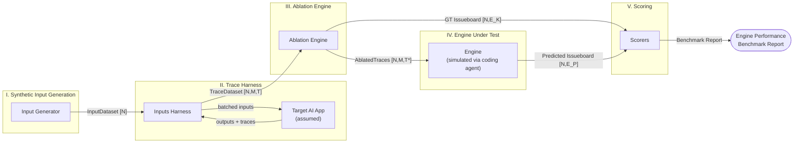
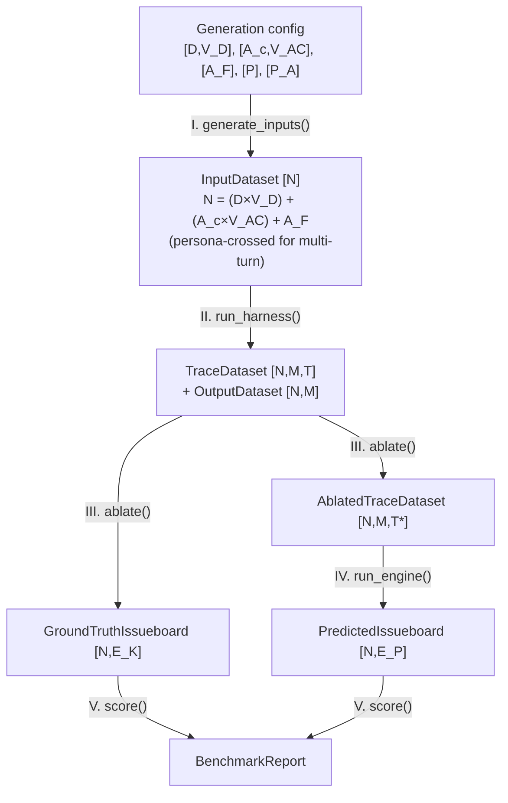

# Engine Benchmarking System — Architecture Overview

A system that builds a benchmark for **Engine** (LangChain's trace-analysis + auto-fix agent).
The core idea: we cannot cheaply obtain expert-labeled ground truth for "what is wrong in
these traces" — so we **manufacture** ground truth by injecting known errors into otherwise
healthy traces, then measure how well Engine rediscovers them.

## The method in one sentence

> Generate traces through a target AI app → ablate them with known issues (this becomes the
> ground truth issueboard) → let Engine predict issues independently → score predictions
> against the injected ground truth.

## Notation

Shape notation used throughout the docs (carried over from the design notes):

| Symbol | Meaning |
|---|---|
| `N` | number of conversations (inputs = personas × variations) |
| `M` | turns per conversation (`M = 1` for single-turn) |
| `T` | trace dimensions (spans, tool calls, retrievals, metadata) |
| `T*` | ablated trace dimensions (known errors injected) |
| `E_K` | known/injected errors — the ground truth |
| `E_P` | errors predicted by Engine |
| `E_h` | hidden errors already present in traces before ablation (unknown) |
| `C_E` | high-level error categories (the taxonomy) |

`[N, M, T]` reads as "a dataset of N conversations, each with M turns, each carrying trace
dimensions T."

## Top-level pipeline



Ownership legend (mirrors the notes):

- **Core systems we build**: Input Generator, Inputs Harness, Ablation Engine, Scorers.
- **Computed / derived**: Input Dataset, Outputs Dataset, Traces, Modified Traces, Issueboards.
- **Assumed**: the Target AI App (any traced LangChain/LangGraph app works); real Engine is
  unavailable, so a coding agent with custom instructions simulates it.

## Stage-by-stage dataflow (shapes)



## Core function signatures

Each stage is a pure-ish function over versioned datasets. Details and atomic diagrams live
in the per-stage docs.

```python
# I.  docs/architecture/02-input-generation.md
def generate_inputs(cfg: GenerationConfig) -> InputDataset: ...

# II. docs/architecture/03-trace-harness.md
def run_harness(inputs: InputDataset, target: TargetAppClient,
                max_turns: int = 1) -> tuple[OutputDataset, TraceDataset]: ...

# III. docs/architecture/04-ablation-engine.md
def ablate(traces: TraceDataset, categories: list[ErrorCategory],
           cfg: AblationConfig) -> tuple[TraceDataset, Issueboard]: ...

# IV. docs/architecture/05-engine-simulation.md
def run_engine(traces: TraceDataset, seed_board: Issueboard,
               engine_cfg: EngineConfig) -> Issueboard: ...

# V.  docs/architecture/06-scoring.md
def score(ground_truth: Issueboard, predicted: Issueboard,
          traces: TraceDataset) -> BenchmarkReport: ...
```

## Why ablation gives (biased but usable) ground truth

Input traces may already contain **hidden errors `E_h`** that no one has labeled. Injected
errors `E_K` are fully known. Engine's predictions `E_P` are scored against `E_K` only, so:

- Every metric is exact **with respect to the injected set** `E_K`.
- Predictions that hit real-but-unlabeled `E_h` issues get counted as false positives →
  precision is **under-estimated**; recall over the true error set is unknowable without
  expert annotation.
- The bias is a direct function of how many `E_h` the ablation process fails to
  surface/overwrite; it shrinks as ablation coverage grows (more test-time compute, richer
  category taxonomy) and as expert annotations accumulate over time.

Full set-relation analysis: [04-ablation-engine.md](04-ablation-engine.md#hidden-error-bias-analysis).

## Document map

| Doc | Contents |
|---|---|
| [01-data-schemas.md](01-data-schemas.md) | Trace, Error, Issueboard, dataset schemas (the contract everything shares) |
| [02-input-generation.md](02-input-generation.md) | Stage I: dimension/persona grids, single vs multi-turn, distribution-trust argument |
| [03-trace-harness.md](03-trace-harness.md) | Stage II: batch + persona-simulator harness, sequence diagrams |
| [04-ablation-engine.md](04-ablation-engine.md) | Stage III: 4-step propose→plan→validate→apply loop, hidden-error bias |
| [05-engine-simulation.md](05-engine-simulation.md) | Stage IV: simulated Engine (deep-agent + meta consolidation) |
| [06-scoring.md](06-scoring.md) | Stage V: error matching, 4 scorers, benchmark report |

## Assignment fit

The deliverable maps onto the assignment requirements as:

- **Inputs**: JSON file of ≥300 traces (`TraceDataset [N,M,T*]`) + issueboard (seed).
- **Expected output**: updated issueboard (`[N,E_K]` merged over the seed board).
- **Scoring function**: `score(gt, pred, traces) -> BenchmarkReport`.
- **Scaling to many tasks**: the whole pipeline is config-driven (`GenerationConfig`,
  `C_E` taxonomy, target-app endpoint) — a new task = new config + new target app.
- **Model comparison** (Sol vs 5.1-mini): run `run_engine` twice with different
  `EngineConfig.model`, score both against the same ground truth.
