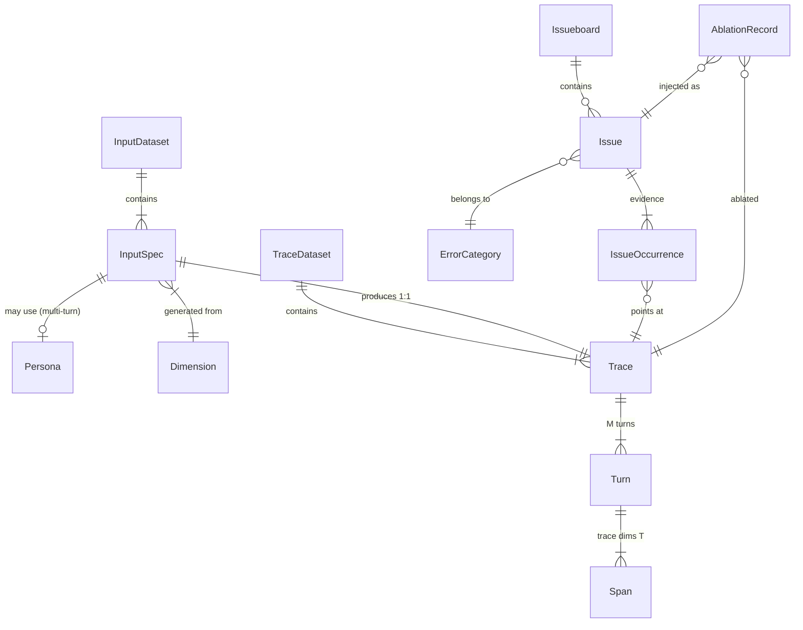
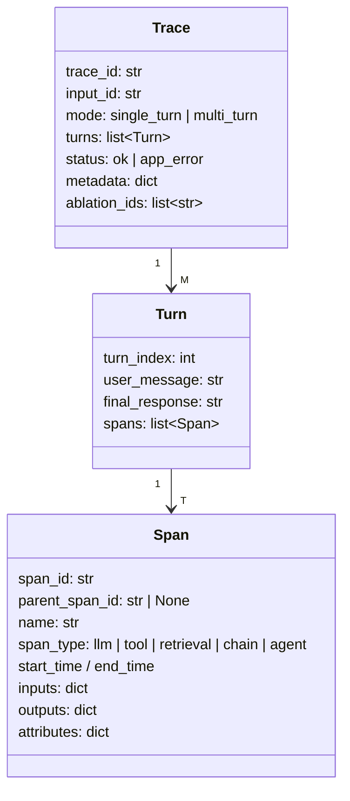
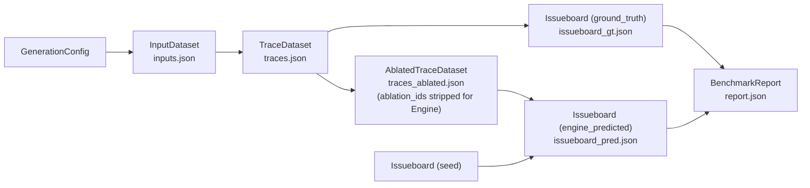

# Data Schemas

The shared contract for every stage. All datasets are JSON files on disk (assignment
requirement: traces ship as a JSON file), versioned by content hash so runs are reproducible.

## Entity relationships



## 1. Input side (Stage I output)

```python
class Dimension(BaseModel):
    """One orthogonal axis of the input space. D safe dims, A_c adversarial dims."""
    dim_id: str
    name: str                    # e.g. "query_topic", "prompt_injection_style"
    kind: Literal["safe", "adversarial"]
    variations: list[str]        # V_D / V_AC concrete values

class Persona(BaseModel):
    persona_id: str
    name: str
    kind: Literal["target", "adversarial"]   # P vs P_A
    description: str             # system prompt for the user-simulator LLM
    goals: list[str]

class InputSpec(BaseModel):
    """One element of the [N] input dataset."""
    input_id: str
    mode: Literal["single_turn", "multi_turn"]
    # provenance — which cell of the generation grid produced this
    dim_id: str
    variation: str
    persona_id: str | None = None      # multi-turn only
    fixed_adversarial_id: str | None = None   # if drawn from A_F library
    # payload
    prompt: str | None = None          # single-turn: the literal user message
    scenario: str | None = None        # multi-turn: scenario brief for the simulator

class InputDataset(BaseModel):
    dataset_id: str                    # content hash
    created_at: datetime
    generation_config: GenerationConfig
    inputs: list[InputSpec]            # len == N
```

## 2. Traces (Stage II output) — `[N, M, T]`

The trace schema is deliberately OTel/LangSmith-shaped: a conversation-level record holding
turns, each turn holding a span tree. This is what Engine reads, what the ablation engine
mutates, and what ships as the ≥300-trace JSON file.



```python
class Span(BaseModel):
    span_id: str
    parent_span_id: str | None
    name: str                          # "ChatOpenAI", "retriever.search", tool name…
    span_type: Literal["llm", "tool", "retrieval", "chain", "agent"]
    start_time: datetime
    end_time: datetime
    inputs: dict                       # llm: messages/prompt; tool: args
    outputs: dict                      # llm: completion; tool: result
    attributes: dict = {}              # model name, token counts, temperature…

class Turn(BaseModel):
    turn_index: int
    user_message: str
    final_response: str
    spans: list[Span]                  # tree via parent_span_id

class Trace(BaseModel):
    trace_id: str
    input_id: str                      # FK → InputSpec
    mode: Literal["single_turn", "multi_turn"]
    turns: list[Turn]
    status: Literal["ok", "app_error"]
    metadata: dict = {}                # app version, model, timestamps
    ablation_ids: list[str] = []       # INTERNAL ONLY — stripped before Engine sees traces

class TraceDataset(BaseModel):
    dataset_id: str
    parent_dataset_id: str | None      # ablated sets point at their source
    traces: list[Trace]
```

> **Important**: `ablation_ids` (and any ablation artifacts) are stripped from the copy
> handed to Engine — the trace file Engine reads must be indistinguishable from an organic
> trace dump, otherwise the benchmark leaks its answers.

## 3. Errors & Issueboard (Stage III + IV currency)

An **Issue** is a cluster-level finding ("this class of failure exists in this app"); an
**IssueOccurrence** ties it to specific traces. This matches Engine's real-world product
shape (issue clusters over traces) and the notes' `issueboard = {trace_id, error_id}` view.

```python
class ErrorCategory(BaseModel):
    """C_E — the high-level taxonomy. Input to ablation, shared vocabulary for scoring."""
    category_id: str
    name: str            # e.g. "tool_misuse", "hallucination", "retrieval_failure",
                         #      "instruction_violation", "formatting", "state_loss",
                         #      "other" (escape hatch — always in Engine's vocabulary so
                         #      out-of-taxonomy E_h discoveries aren't shoehorned)
    description: str

class Issue(BaseModel):
    """One error definition. E_K entries are authored by ablation; E_P by Engine."""
    error_id: str
    title: str                         # single-phrase title
    description: str                   # verbose description
    category_id: str                   # FK → ErrorCategory
    severity: Literal["low", "medium", "high"]
    injection_mode: Literal["replay_edit", "dependency_fault"] | None = None
    # ^ E_K entries ONLY — post-hoc analysis of which ablation kind benchmarks
    #   more fairly. Stripped from anything Engine sees; never consumed by scorers.

class IssueOccurrence(BaseModel):
    error_id: str
    trace_id: str
    turn_index: int | None = None      # optional localization
    span_id: str | None = None
    evidence: str | None = None        # Engine's cited snippet / ablation's injected diff

class Issueboard(BaseModel):
    board_id: str
    source: Literal["seed", "ground_truth", "engine_predicted"]
    issues: list[Issue]
    occurrences: list[IssueOccurrence]     # the {trace_id, error_id} matrix
```

`[N, E_K]` = `Issueboard(source="ground_truth")`; `[N, E_P]` = `Issueboard(source="engine_predicted")`.
The assignment's *"inputs: …, issueboard"* is the `seed` board (possibly empty) that Engine
must **update**, mirroring the real product where an issueboard already exists.

## 4. Ablation artifacts (Stage III internal)

```python
class AblationSpec(BaseModel):
    """Filter + strategy for injecting one error. Produced by step 2, validated by step 3."""
    error_id: str                      # FK → Issue (the E_K entry this injects)
    mode: Literal["replay_edit", "dependency_fault"]
    filter: TraceFilter                # which traces are eligible
    ablation_actions: list[AblationAction] = []   # replay_edit: turn-k mutations
    fault_config: FaultConfig | None = None       # dependency_fault: shim + behavior
    target_count: int                  # sub-sample size after filtering

class FaultConfig(BaseModel):
    """dependency_fault mode: which external-dependency shim to arm, and how."""
    shim: Literal["llm_proxy", "retriever", "tool"]
    target: str                        # e.g. tool name, retriever endpoint
    behavior: str                      # "irrelevant_docs", "timeout", "truncate_output"…
    params: dict = {}

class TraceFilter(BaseModel):
    """Declarative selection over trace properties — a list of SDK predicate steps."""
    steps: list[FilterStep]            # e.g. span_type == "tool", turn_count >= 2

class FilterStep(BaseModel):
    field: str                         # JSONPath-ish selector into Trace
    op: Literal["eq", "ne", "contains", "regex", "gt", "lt", "exists"]
    value: Any

class AblationAction(BaseModel):
    """A str-in → str-out mutation applied at a located field."""
    target: str                        # JSONPath-ish selector (which field to mutate)
    transform: Literal["replace", "regex_sub", "llm_rewrite", "delete", "inject"]
    params: dict                       # replacement text, regex, rewrite instruction…

class AblationRecord(BaseModel):
    """Ground-truth provenance: exactly what was done to which trace."""
    ablation_id: str
    error_id: str
    trace_id: str
    actions_applied: list[AblationAction]
    before_after: list[tuple[str, str]]    # (original, mutated) per action — audit trail

class AblationSplit(BaseModel):
    """Input-level control/ablate assignment, made once before any ablation.
    Ground-truth side only — stripped from everything Engine sees."""
    seed: int
    control_fraction: float
    strata: list[str]                      # stratification keys (mode, safe/adv, dim)
    control_input_ids: list[str]           # never ablated, never re-run with shims
    ablate_input_ids: list[str]            # sole population filters run against
```

## 5. Benchmark report (Stage V output)

```python
class OccurrenceMatch(BaseModel):
    """Layer 1: one predicted occurrence resolved via the exact (trace, category) key."""
    trace_id: str
    predicted_error_id: str
    resolved_error_id: str | None      # None → FP / E_h candidate pool
    method: Literal["exact_key", "text_fallback"]   # fallback = wrong-category case

class ErrorMatch(BaseModel):
    """Layer 2: predicted issue → known error, by argmax occurrence-set overlap."""
    predicted_error_id: str
    matched_error_id: str | None       # None → no resolved occurrences (candidate FP / E_h)
    overlap: int                       # winning |occurrences ∩ traces(K_i)| vote count
    tie_broken_by_text: bool = False

class CategoryScore(BaseModel):
    category_id: str
    precision: float; recall: float; f1: float; cohens_kappa: float
    support: int

class BenchmarkReport(BaseModel):
    report_id: str
    engine_config: EngineConfig            # which model/agent produced E_P
    base_rates: dict                       # control fraction, per-error injection counts
    matcher_fallback_rate: float           # how often text fallback fired (reliability)
    occurrence_matches: list[OccurrenceMatch]
    matches: list[ErrorMatch]
    category_scores: list[CategoryScore]   # scorer 1
    per_error_scores: list[CategoryScore]  # scorer 2 (after E_P→E_K mapping)
    severity_loss: float                   # scorer 3 (asymmetric)
    description_scores: dict[str, float]   # scorer 4, keyed by matched error_id
    headline: dict                         # macro-P/R/F1, weighted composite
```

## Dataset lineage



Every artifact carries the `dataset_id` of its parent, so any report can be traced back to
the exact config, traces, and ablation records that produced it.
