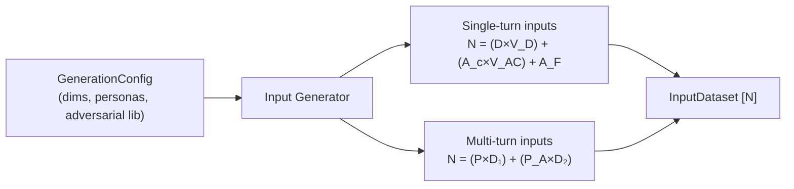
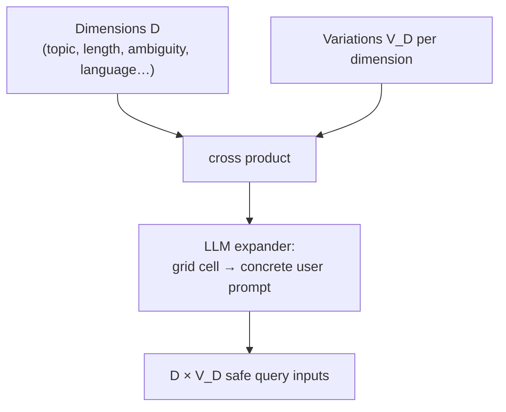
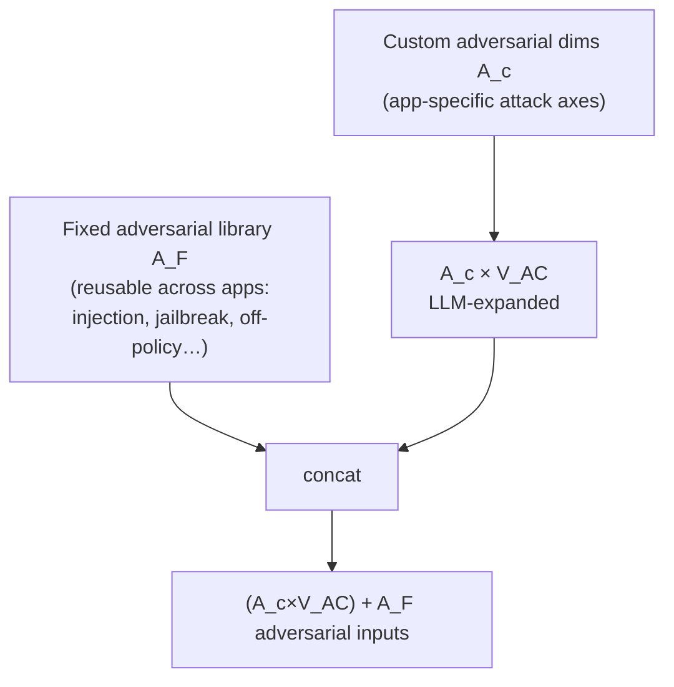
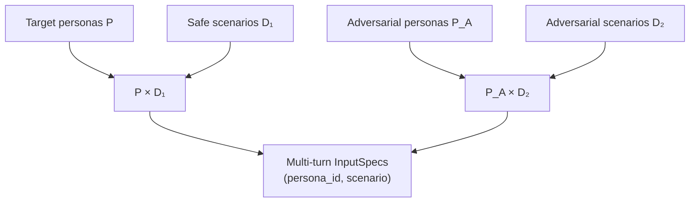
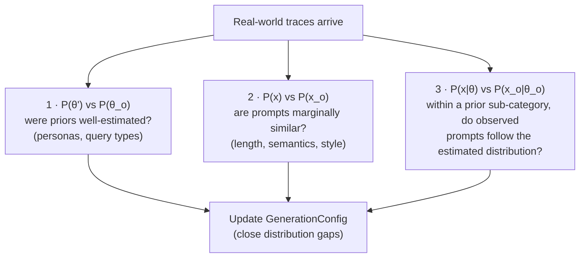

# Stage I — Synthetic Input Generation

Runs against the target app **pre-prod** (no real user data required). Produces the
`InputDataset [N]` from a small, human-authored generation config.

```
[D, V_D], [A_c, V_AC], [A_F], [P], [P_A]  →  [ (D×V_D) + (A_c×V_AC) + A_F , (P + P_A) ]
                                              total input variations        total personas
```

| Symbol | Meaning |
|---|---|
| `D, V_D` | orthogonal **safe** query dimensions, each with `V_D` variations |
| `A_c, V_AC` | **custom app-specific adversarial** dimensions, each with `V_AC` variations |
| `A_F` | **fixed reusable adversarial** inputs (app-agnostic library: jailbreaks, injections…) |
| `P` | target user personas (multi-turn) |
| `P_A` | adversarial user personas (multi-turn) |

## High-level flow



## Atomic view: the three generators

### I.A — Single-turn safe inputs



```python
def generate_safe_inputs(dims: list[Dimension]) -> list[InputSpec]:
    """[D, V_D] -> D×V_D single-turn prompts. LLM turns each (dim, variation)
    grid cell into a concrete, natural user message."""
```

### I.C — Adversarial inputs

Two sources, concatenated:



```python
def generate_adversarial_inputs(custom_dims: list[Dimension],
                                fixed_library: list[InputSpec]) -> list[InputSpec]:
    """[A_c, V_AC], [A_F] -> (A_c×V_AC) + A_F adversarial inputs."""
```

### I.B — Multi-turn scenario assembly

For multi-turn, inputs are not literal prompts but **(persona, scenario)** pairs consumed by
the Stage II user-simulator. Personas are split across scenario pools so adversarial
personas drive adversarial scenarios:

```
D₁ = D × V_D                 (safe scenario pool)
D₂ = (A_c × V_AC) + A_F      (adversarial scenario pool)
N  = (P × D₁) + (P_A × D₂)   persona-wise variation split
M  = [1, max_turns]
```



```python
def assemble_multi_turn(personas: list[Persona], adversarial_personas: list[Persona],
                        safe_pool: list[InputSpec],
                        adversarial_pool: list[InputSpec]) -> list[InputSpec]:
    """[P],[P_A],D₁,D₂ -> (P×D₁)+(P_A×D₂) persona-crossed scenarios."""
```

### Top-level signature

```python
class GenerationConfig(BaseModel):
    safe_dims: list[Dimension]                # D with V_D
    adversarial_dims: list[Dimension]         # A_c with V_AC
    fixed_adversarial: list[InputSpec]        # A_F
    personas: list[Persona]                   # P (optional → single-turn only)
    adversarial_personas: list[Persona]       # P_A
    mode: Literal["single_turn", "multi_turn", "mixed"]
    max_turns: int = 1
    seed: int                                 # reproducibility of LLM expansion

def generate_inputs(cfg: GenerationConfig) -> InputDataset: ...
```

## Why this process can be trusted

Ideally the synthetic input distribution `D_s` is representative of the real-world
distribution `D_o`:

```
D_o :  P(x) = ∫ P(x|θ_o) P(θ_o) dθ    where θ_o = {P_o, I_o},  I_o = {D_o, A_o}
```

Real-world prompts `x` arise from how real personas (`P_o`) interact with the app across
real intents/dimensions (`I_o`). The generator's job is to estimate `P, I` such that they
are **equivalent to or supersets of** `P_o, I_o` — dimensions and personas are our explicit,
auditable priors over that latent structure.

The actual test only becomes possible once real-world observations exist. At that point,
three comparisons benchmark the generator itself:



This makes Stage I itself benchmarkable and iteratively improvable — the same philosophy the
whole system applies to Engine.
