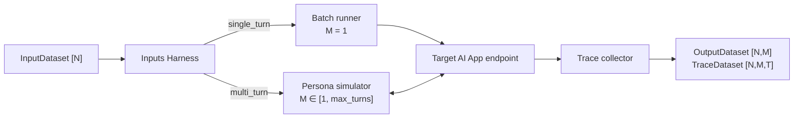
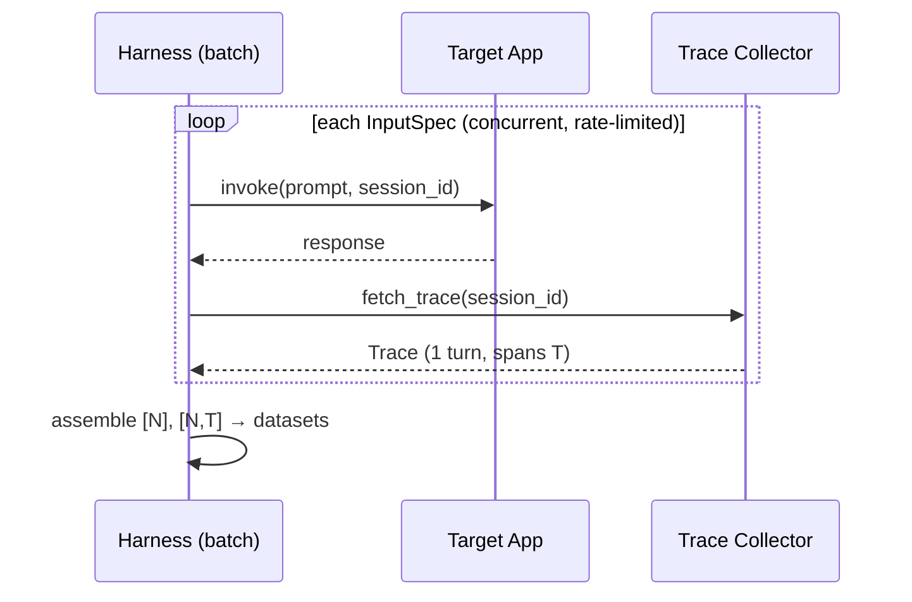
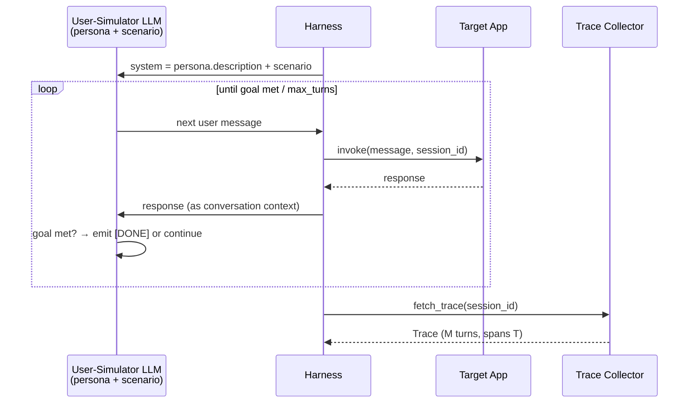
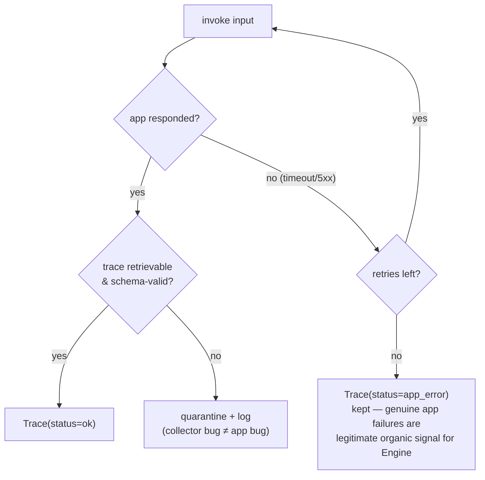

# Stage II — Trace Harness (Generating Outputs & Traces)

A thin wrapper that batches inputs against the target app's endpoint and collects the
resulting outputs and traces.

```
[N]  →  [N, M], [N, M, T]
inputs   outputs   traces
```

The target app is **assumed**: any app whose endpoint we can call and whose traces we can
read (LangSmith SDK, OTel export, or in-process callback). The harness never inspects app
internals — it only drives the endpoint and harvests traces.

## High-level flow



```python
class TargetAppClient(Protocol):
    """Adapter over the assumed target app."""
    def invoke(self, message: str, session_id: str) -> AppResponse: ...
    def fetch_trace(self, session_id: str) -> Trace: ...

def run_harness(inputs: InputDataset, target: TargetAppClient,
                max_turns: int = 1,
                concurrency: int = 8) -> tuple[OutputDataset, TraceDataset]: ...
```

## II.A — Single-turn batch runner (`M = 1`)

`N = (D×V_D) + (A_c×V_AC) + A_F`, each input is a literal prompt; fire, collect, done.



```python
def run_single_turn(spec: InputSpec, target: TargetAppClient) -> Trace:
    """One prompt → one response → one 1-turn trace."""
```

## II.B — Multi-turn persona simulator (`M ∈ [1, max_turns]`)

Loads an LLM with the persona description + scenario and lets it converse with the target
app until the scenario resolves or `max_turns` is hit.



```python
def run_multi_turn(spec: InputSpec, persona: Persona,
                   target: TargetAppClient, max_turns: int) -> Trace:
    """Persona-simulator loop → M-turn conversation trace."""
```

## Failure handling & hygiene



Two deliberate choices:

- **App errors are kept**, not discarded — a target app that times out or crashes produced a
  real (organic, non-injected) issue. These are part of the hidden-error set `E_h`.
- **Collector failures are quarantined** — a malformed trace is our bug, not signal.

## Scale notes

- The harness is embarrassingly parallel across inputs; a semaphore caps concurrency to
  respect target-app rate limits.
- To reach the assignment's ≥300 traces: e.g. single-turn `D=6, V_D=25` → 150, plus
  `A_c=4, V_AC=20` → 80, plus `A_F=70` → **300**, before any multi-turn additions.
- Deterministic `session_id = hash(dataset_id, input_id)` makes reruns idempotent and
  resumable (skip inputs that already have an ok trace).
