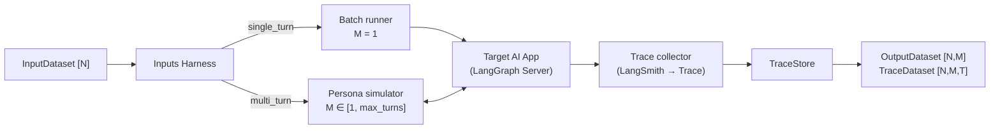
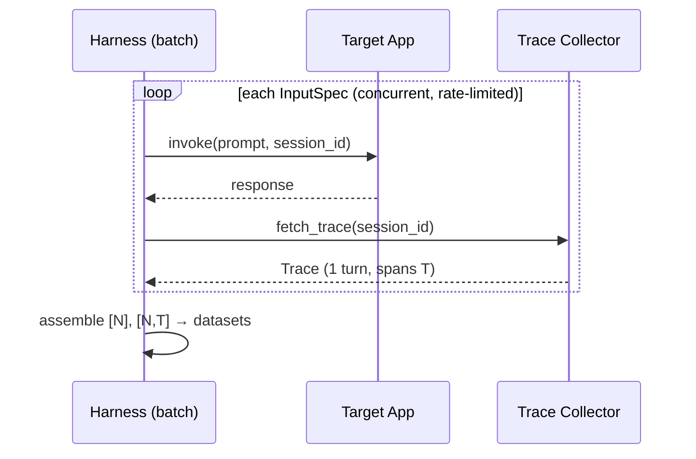
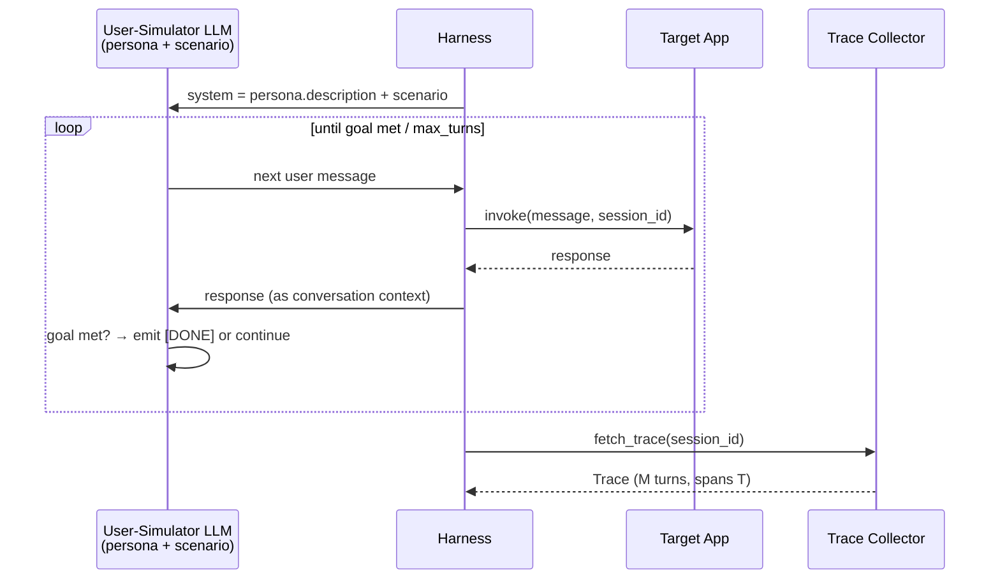
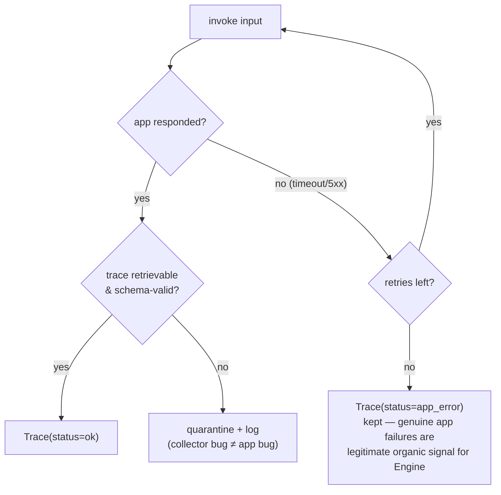
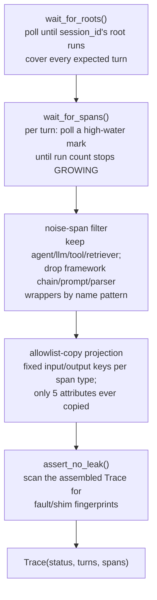

# Stage II — Trace Harness (Generating Outputs & Traces)

A thin wrapper that batches inputs against the target app's endpoint and collects the
resulting outputs and traces.

```
[N]  →  [N, M], [N, M, T]
inputs   outputs   traces
```

Conceptually, the target app is **assumed**: any app whose endpoint we can call and whose
traces we can read. The harness never inspects app internals — it only drives the endpoint
and harvests traces. **v0 implementation note**: concretely, both apps in this repo are
LangGraph apps served via `langgraph.json` (`langgraph dev`), and the harness drives them
exclusively through `langgraph_sdk` against a `base_url` from `TargetAppConfig`
(`configs/target_app.yaml`) — never by importing app code
(docs/execution-plan.md, "The black-box contract"). Trace collection is LangSmith in v0
(see "Trace collector" below); the boundary that makes this replaceable is the `TraceStore`
everything downstream reads from.

## High-level flow



```python
class TargetAppClient(Protocol):
    """Adapter over the assumed target app."""
    def invoke(self, message: str, session_id: str) -> AppResponse: ...
    def fetch_trace(self, session_id: str) -> Trace: ...

def run_harness(inputs: InputDataset, target: TargetAppClient,
                max_turns: int = 1,
                concurrency: int = 8) -> tuple[OutputDataset, TraceDataset]: ...
```

**v0 implementation note — the shipped client surface.** The conceptual `invoke` +
`fetch_trace` pair above is what the harness *needs*; what it actually talks to is a thread,
not a stateless call, because checkpoint time-travel (Mode A) requires server-side thread
state. `benchmark/harness/client.py` defines the real protocol:

```python
class TargetAppClient(Protocol):
    def create_thread(self) -> str: ...
    def invoke(self, thread_id: str, message: str, *, session_id: str,
               turn_index: int = 0, configurable: dict[str, Any] | None = None,
               checkpoint: dict[str, Any] | None = None,
               metadata: dict[str, Any] | None = None) -> AppResponse: ...
    def get_state(self, thread_id: str) -> dict: ...
    def get_history(self, thread_id: str, limit: int = 100) -> list[dict]: ...
    def update_state(self, thread_id: str, values: Any, *,
                      checkpoint: dict[str, Any] | None = None) -> dict: ...
```

`LangGraphAppClient` is the one implementation, over `langgraph_sdk.get_sync_client`:

- **Thread-per-conversation.** `create_thread()` once per `InputSpec`; every turn of that
  conversation (single- or multi-turn) is `invoke()` on the same `thread_id`, so LangGraph's
  own checkpointer carries state across turns instead of the harness replaying history.
- **`invoke` is `client.runs.wait(...)`**, with `config={"configurable": ...}` for Mode C
  fault arming and `checkpoint=...` for resuming a Mode-A fork. Retried with backoff on
  transport failure; a failure after retries comes back as `AppResponse(error=...)` rather
  than raising, so the runner can still store an `app_error` trace. `configurable` values
  are always **mappings**, never scalars — see "Trace collector" below for why.
- **`update_state`** is the time-travel primitive `replay()` (below) is built on: rewrite
  the message at a given checkpoint, get back a fork checkpoint to resume from.
- **Idempotent, deterministic `session_id`.** `session_id_for(dataset_id, input_id)` hashes
  to a stable id, stamped into LangGraph run metadata on every turn — this is both how the
  collector finds the session's run trees in LangSmith and how `trace_id_for(session_id)`
  lets a rerun skip an input whose `ok` trace is already in the `TraceStore`, before
  spending an app invocation. A `variant` suffix (`session_id_for(..., variant=...)`)
  namespaces Mode-C and Mode-A re-runs of the same input so they don't collide with the
  plain batch run or each other.

## II.A — Single-turn batch runner (`M = 1`)

`N = (D×V_D) + (A_c×V_AC) + A_F`, each input is a literal prompt; fire, collect, done.



```python
def run_single_turn(spec: InputSpec, target: TargetAppClient) -> Trace:
    """One prompt → one response → one 1-turn trace."""
```

**v0 implementation note**: `fetch_trace(session_id)` above is conceptual; the shipped
runner does not poll-then-normalize inline — it calls `Harness._collect`, which delegates to
the `LangSmithCollector` (see "Trace collector" below) and stores the result via `TraceStore`
directly. `invoke` also opens the thread first (`create_thread()`), since even a single-turn
input runs on a thread.

## II.B — Multi-turn persona simulator (`M ∈ [1, max_turns]`)

Loads an LLM with the persona description + scenario and lets it converse with the target
app until the scenario resolves or `max_turns` is hit.



```python
def run_multi_turn(spec: InputSpec, persona: Persona,
                   target: TargetAppClient, max_turns: int) -> Trace:
    """Persona-simulator loop → M-turn conversation trace."""
```

**v0 implementation note**: the simulator (`benchmark/harness/simulator.py`) terminates on a
`[DONE]` token emitted by the user-simulator LLM; a `[DONE]` on turn 0 (no message yet) opens
with the raw scenario text instead of yielding a zero-turn conversation. Every turn is
invoked on the same `thread_id` the persona conversation opened with — the harness never
replays prior history itself, since the LangGraph checkpointer already holds it.

## Failure handling & hygiene



Two deliberate choices:

- **App errors are kept**, not discarded — a target app that times out or crashes produced a
  real (organic, non-injected) issue. These are part of the hidden-error set `E_h`.
- **Collector failures are quarantined** — a malformed trace is our bug, not signal.

**v0 implementation note**: `Quarantine` (`benchmark/harness/runner.py`) writes one JSON
record per failed session under `data/quarantine/`, with the failure reason and enough
context (`input_id`, `dataset_id`, `mode`) to retry it; a later successful run of the same
input discards its stale quarantine record rather than leaving a resolved fault reported
forever. `COLLECTION_FAILURES` (`IngestionTimeout`, `LeakDetected`, schema `ValidationError`,
and a couple of narrower `ValueError`/`KeyError` cases) is exactly what routes to quarantine;
everything else propagates. One asymmetry worth naming: if the app itself errored (5xx,
timeout) *and* the collector then also fails, the run is not quarantined — a retrievable
run-tree-less `Trace(status="app_error")` is synthesized instead
(`Harness._error_only_trace`), because a genuine app failure is organic signal and
quarantining it would silently delete real `E_h` evidence from the corpus.

## Trace collector (v0 implementation)

The collector (`benchmark/harness/collector.py`, `LangSmithCollector`) is the **only
LangSmith-aware module** in the system — everything downstream of it reads the Phase-0
`TraceStore` (our schema, local JSON), never a LangSmith type
(docs/execution-plan.md, "Tracing backend"). Four things it is deliberately paranoid about:



- **Allowlist-copy leak scrub.** A `Span` is *built*, never *cast*, from a LangSmith run: a
  fixed set of input/output keys per span type, and a fixed set of five attributes
  (`run_type`, `model`, `tokens`, `error`, `duration_ms`). `run.extra`, `run.tags` and
  `run.serialized` are read for exactly one allowlisted value
  (`extra.metadata.ls_model_name`) and never copied wholesale — that channel is how
  LangChain promotes `config.configurable` entries into LangSmith-inheritable run metadata,
  which is how an armed Mode-C fault key would otherwise land on every span of a run
  (`apps/target_app/README.md`, "Trace leak surface"). This allowlist is what actually
  prevents leaks; `assert_no_leak()` (`benchmark/harness/scrub.py`) is a tripwire on top of
  it — a structural-token scan of the finished `Trace` that fails loudly if a future field
  addition drags a fault fingerprint back in. It excludes `Trace.ablation_ids` from the scan
  (see "Deferred design decisions" in [04-ablation-engine.md](04-ablation-engine.md) for why).
- **Explicit select projections + anti-vacuity guards.** Runs are fetched with an explicit
  `select=` (`SPAN_SELECT`), never the client's default projection — LangSmith's `list_runs`
  does not project `serialized` unless asked, and a `getattr` fallback on a missing field
  would silently audit or normalize nothing. `VacuousProjectionError` is raised if a
  required field the normalizer reads comes back `None` (a kept `llm`/`tool`/`retriever` run
  with `inputs is None` means the projection dropped the payload, not that there was none),
  and separately if the llm-manifest audit (`audit_llm_manifests`) cannot fetch a `serialized`
  for every llm run in the trace.
- **Noise-span filter.** A run is kept if it is the root, or its `run_type` is
  `llm`/`tool`/`retriever` (always meaningful), or it is `chain`/`prompt`/`parser` **and**
  its name does not match a framework-noise pattern (`Runnable*`, `Channel*`,
  `__start__`/`__end__`, `*.wrap_model_call`, output parsers, the `create_react_agent`
  `Prompt` assembly step, conditional-edge predicates). Dropping a span re-parents its
  surviving children onto the nearest surviving ancestor so the tree stays connected. This
  is what keeps the corpus carrying app semantics rather than LangGraph/LangChain plumbing —
  it is also why the target app dropped `deepagents` in Phase 2 (its scaffold added ~10
  middleware spans of noise per turn for a two-tool app; see
  [00-overview.md](00-overview.md)).
- **Bounded, loud, high-water-mark ingestion wait.** LangSmith ingests child spans
  asynchronously and can lag the root by up to ~30s, arriving in bursts with occasional
  short pages (eventual consistency, not shrinkage). `wait_for_spans()` tracks a
  **high-water mark**, not a delta from the previous poll: a page that is momentarily one run
  short does not reset the stability window, but genuine growth does. It stops once the count
  has been stable for `settle_polls` consecutive polls *and* at least one `llm` span is
  present, or raises `IngestionTimeout` after `child_timeout_s` (default 150s, sized from a
  measured worst case of ~60s for a 24-run tree) rather than normalizing a half-ingested tree
  into a quietly truncated `Trace`.
- **`status="app_error"` kept, malformed traces quarantined.** Same policy as "Failure
  handling & hygiene" above, enforced at the collector boundary: `require_children=False` on
  an `app_error` session relaxes the "at least one llm span" floor, since a genuinely failed
  run may never have reached a model call.

## Phase-5-facing APIs

Two methods on `Harness` are the entire surface the ablation engine (Stage III,
[04-ablation-engine.md](04-ablation-engine.md)) is built against — it never talks to
`langgraph_sdk` or LangSmith directly.

### `replay` — Mode A, via checkpoint time-travel fork

```python
def replay(thread_ref: str, checkpoint_ref: str | dict, corrupted_state: Any,
           remaining_user_messages: list[str], *, input_id: str = "",
           dataset_id: str = "", store_result: bool = True) -> Trace:
    """Fork `thread_ref` at `checkpoint_ref` with `corrupted_state` written in
    (via `client.update_state`), then resume by invoking one turn per entry
    in `remaining_user_messages`. Returns the trace of the REGENERATED TURNS
    ONLY — the caller splices `turns[0..k-1] + corrupted k` onto this result
    to assemble T*."""
```

- The fork *is* the new thread head: only the first resumed `invoke` passes the fork
  checkpoint; later turns continue normally.
- Requires at least one entry in `remaining_user_messages` — a single-turn (`M = 1`)
  Mode-A injection has no downstream to regenerate and is a consistency-managed post-hoc
  edit instead, not a `replay()` call (see 04-ablation-engine.md).
- `metadata` on the returned trace carries `thread_id`, `source_checkpoint_id` and
  `fork_checkpoint_id`, so the splice the ablation engine performs is auditable after the
  fact.
- A companion, `locate_checkpoint(thread_id, response_text="", *, turn_index=None)`, finds
  the `(checkpoint_id, message_id)` to fork at. Passing `turn_index` alone, `response_text`
  alone, or both is supported; matching on text alone that hits **more than one** turn raises
  `AmbiguousCheckpoint` rather than silently picking one — two turns ending in the same
  words is ordinary, and forking at the wrong one would mislabel the ground-truth turn index.

### `run_with_faults` — Mode C, via declared `configurable` fault keys

```python
def run_with_faults(input_spec: InputSpec, fault_config: FaultConfig, *,
                     dataset_id: str = "", baseline: Trace | None = None,
                     weak_validation: bool = False, persona: Persona | None = None,
                     max_turns: int = 1, store_result: bool = True) -> Trace:
    """Arm a fault declared in TargetAppConfig.fault_configurable_keys, re-run
    the input, and prove activation before persisting."""
```

- `fault_config` maps to a `config.configurable` payload whose value is **always a mapping**
  (`{"behavior": ..., "params": {...}}`), never a scalar — a scalar would be promoted by
  LangChain into LangSmith-inheritable run metadata and stamp the fault name onto every span
  of the run. Requesting a shim kind the target app has not declared raises `UndeclaredFault`
  before the app is ever touched.
- **Activation validation is a baseline diff, not a presence check.** Pass `baseline` (the
  unarmed trace for the same input) and the check is a byte-diff of the span the fault must
  corrupt against that baseline; passing `weak_validation=True` instead accepts the weaker
  form (the dependency merely ran), which a fully disarmed run would also satisfy. Passing
  neither raises — silently downgrading to the weak form is not an option. `FaultNotActivated`
  is raised if the diff shows nothing changed.
- **Activation evidence is published out-of-band**, on `Harness.activation_evidence[trace_id]`
  — deliberately **not** a field on the `Trace` itself, since a trace that names where its
  own fault is would hand Engine the ground truth it is supposed to discover.
- The trace is persisted only *after* activation is proven; an armed run whose fault never
  activated is not written to the `TraceStore` at all, so an unlabelled fault-contaminated
  trace can never leak into the corpus as organic signal.

## Scale notes

- The harness is embarrassingly parallel across inputs; a semaphore caps concurrency to
  respect target-app rate limits.
- To reach the assignment's ≥300 traces: e.g. single-turn `D=6, V_D=25` → 150, plus
  `A_c=4, V_AC=20` → 80, plus `A_F=70` → **300**, before any multi-turn additions.
- Deterministic `session_id = hash(dataset_id, input_id)` makes reruns idempotent and
  resumable (skip inputs that already have an ok trace).
