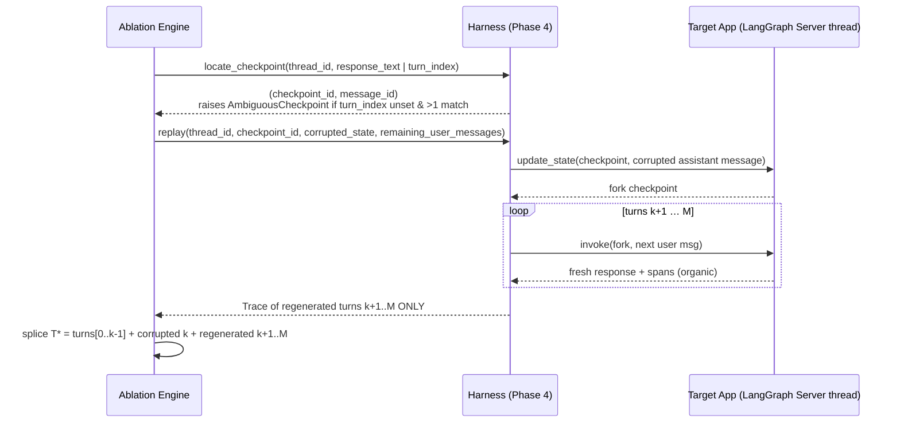
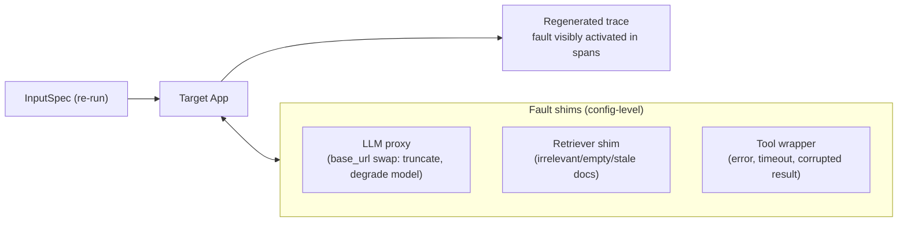
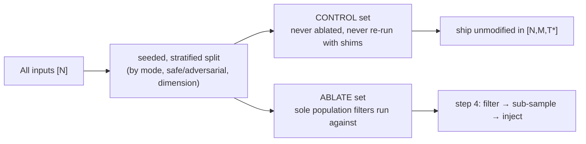
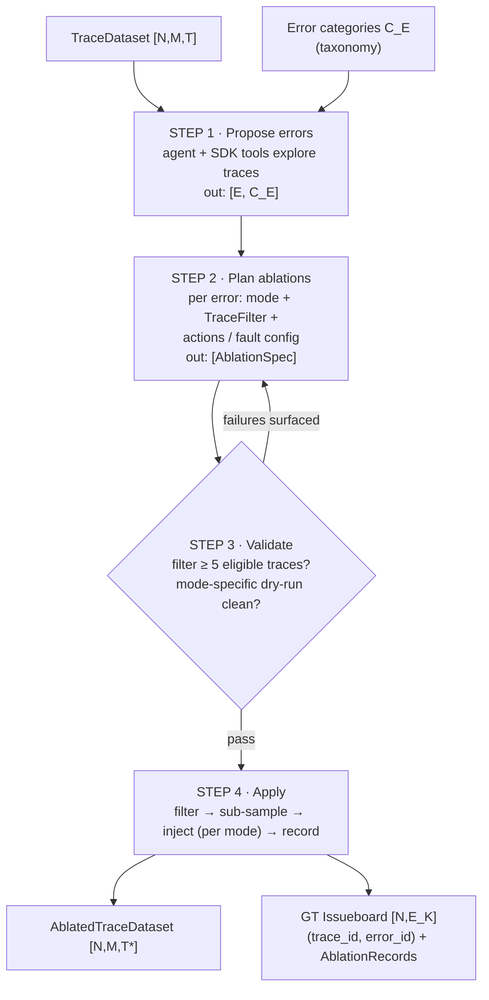
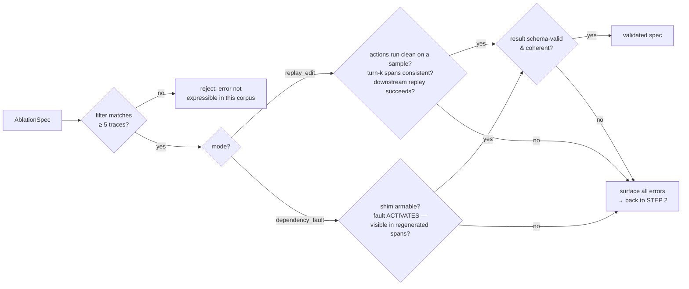
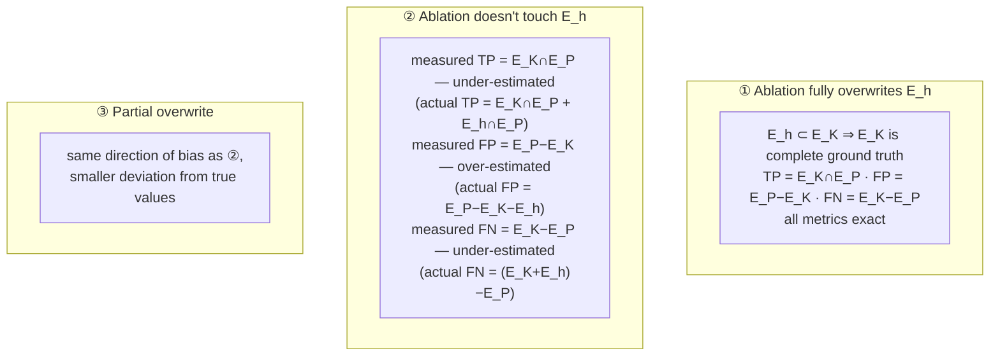

# Stage III — The Ablation Engine

Injects known errors `E` into traces and records the injections as ground truth.

```
[N, M, T]  →  [N, M, T*], [N, E_K]
traces        ablated traces  ground-truth issueboard
```

**Goal**: manufacture ground truth by construction — every injected error is fully known
(what, where, how), so scoring against it is exact.

**Nuance**: input traces may already contain unknown hidden errors `E_h`. Ablations must be
compatible with those (see [bias analysis](#hidden-error-bias-analysis)).

## Injection modes (locked design decision)

Naive post-hoc editing of a single span breaks **causal consistency**: downstream spans and
the final response remain consistent with the *original* content, so ablated traces carry
artificial inconsistencies organic failures never produce. The system therefore supports two
injection modes, chosen per error definition:

| | **Mode A — `replay_edit` (default)** | **Mode C — `dependency_fault` (optional)** |
|---|---|---|
| What is injected | The **error manifestation itself** — corrupted content at a turn boundary | The **error mechanism** — a fault in an external dependency |
| How consistency is kept | Turns after the injection point are **regenerated organically** through the app | The whole trace is **regenerated organically** with the fault active |
| Error classes covered | Content errors: hallucination, tone, formatting, instruction violation, wrong/incomplete answers | Mechanism errors: retrieval garbage, tool failure/timeout, empty results, flaky APIs, degraded model |
| Ground truth is exact for | The corrupted content (we wrote it) | The activated mechanism fault (visible in the trace by construction) |
| Target-app requirement | Checkpointing enabled (LangGraph time-travel: fork + `update_state`) | **Config-level control of external dependencies** (LLM `base_url` proxy, retriever endpoint, tool shims) — no source access needed |

### Mode A — `replay_edit`

Corrupt the content of one turn, then replay the remainder of the conversation through the
real app so everything downstream coherently builds on the corruption.

> **v0 implementation note — supersedes the "stateless client-supplied history" contract.**
> An earlier revision of this doc required the target app to accept client-supplied
> conversation history on a stateless endpoint. That is **not what shipped, and not what the
> target app supports** (`apps/target_app`: no checkpointer means the LangGraph *server*
> owns thread persistence — a stateless replay-by-resending-history would have nothing to
> attach to). What shipped instead is **checkpoint time-travel**: `Harness.locate_checkpoint`
> finds where turn k ended on the thread, `Harness.replay` forks it with `update_state`
> (writing the corrupted assistant message at that checkpoint) and resumes by invoking the
> remaining user messages on the fork. This is a strictly cleaner primitive for the same
> capability — forking at a checkpoint *is* the "believe the corrupted turn" requirement,
> without needing the app to be stateless (docs/execution-plan.md, "The black-box contract").



- **Splicing is the ablation engine's job, not the harness's.** `Harness.replay` returns only
  the trace of the regenerated turns; the ablation engine assembles `T*` by splicing
  `turns[0..k-1] + corrupted k + regenerated k+1..M` — `replay`'s `metadata` carries
  `thread_id`, `source_checkpoint_id` and `fork_checkpoint_id` so the splice stays auditable.
- **Single-turn degenerate case** (`M = 1`, the bulk of the corpus): there is no downstream
  to replay — Mode A reduces to a consistency-managed post-hoc edit (corrupt the response,
  rewrite the one producing LLM span to match) done directly by the ablation engine, without
  calling `Harness.replay` at all (which requires at least one entry in
  `remaining_user_messages`). Acceptable: the consistency surface is a single span.
- **Intra-turn limitation** (why Mode C exists): the endpoint cannot be forced to make a bad
  tool call or garbage retrieval — editing those spans post-hoc would evaporate on replay.
  Mechanism errors are out of Mode A's reach by construction.
- **Threads are server-lifetime state, not a per-ablation resource.** A `thread_id` lives on
  the LangGraph server for as long as that server session runs; there is no cross-session
  thread durability the ablation engine can depend on. In practice this means ablation runs
  against one thread within the *same* server session that produced it (the session that ran
  Stage II) — forking a thread from a server session that has since restarted is not a
  supported operation.
- **Observed self-correction: author corruptions around corpus-irrefutable facts.** The
  target app re-searches its own corpus on a follow-up question, and can partially
  *retract* an injected corruption if the corrupted fact is also derivable from the corpus —
  e.g. a corrupted refund-window number can get silently re-derived as the correct value on
  the next turn, because the app searched again and found it. Verified empirically in
  `apps/target_app/scripts/gate3_time_travel.py`: the gate's corrupted answer bundles a
  refund-window figure (correctly re-derivable, and observed to get echoed either way) with
  an invented case reference (`NBX-4471`, corpus-irrefutable — it exists nowhere but in the
  edit) and asserts only that the **irrefutable marker is referenced, not that every
  corrupted fact survives verbatim**. The practical consequence for Step 2 planning
  (`plan_ablation`, below): `replay_edit` corruptions are more robust ground truth when
  authored around a fact the app has no way to independently verify or re-derive, rather than
  one sitting in the corpus waiting to be re-searched.

```python
def apply_replay_edit(trace: Trace, spec: AblationSpec,
                      harness: Harness) -> tuple[Trace, AblationRecord]:
    """Locate the turn-k checkpoint, corrupt it, and either:
    - M=1: rewrite the response + turn-k spans in place (no harness.replay call), or
    - M>1: harness.replay(...) to regenerate k+1..M, then splice T* here."""
```

### Mode C — `dependency_fault`

Activate a fault in an external dependency and re-run the input through the app; the
resulting trace is organically, causally consistent end-to-end — including intra-turn spans.



**Ground truth is defined at the mechanism level, not the outcome level.** The known error
is e.g. *"retrieval returned irrelevant documents"* — guaranteed true and trace-observable
by construction — not *"final answer is wrong"*, which the app may dodge by self-correcting
from parametric memory.

**Activation is sufficient; there is no manifestation verifier.** If the app recovers and
the final answer happens to be accurate, the trace still contains a real, flaggable issue
(e.g. answer sourced from training memory instead of the degraded store — an
ungroundedness/retrieval-bypass problem: unauditable, stale-data-prone). Catching activated
mechanism faults regardless of outcome accuracy falls squarely within Engine's
responsibilities, so these traces keep their `E_K` entries. Validation checks **activation
only** (the fault is visible in the trace spans), never outcome.

```python
def apply_dependency_fault(input_spec: InputSpec, spec: AblationSpec,
                           harness: Harness, baseline: Trace) -> tuple[Trace, AblationRecord]:
    """harness.run_with_faults(input_spec, spec.fault_config, baseline=baseline)
    — arms the shim, re-runs the input, proves activation as a byte-diff
    against the unarmed baseline, and only then persists the trace."""
```

**v0 implementation note — `harness.run_with_faults` is the whole Mode-C mechanism.** There
is no separate `ShimRegistry` the ablation engine drives; `Harness.run_with_faults`
(Phase 4, [03-trace-harness.md](03-trace-harness.md#phase-5-facing-apis)) owns arming,
re-running, and validating in one call:

- **Declared configurable keys, mapping-shaped values.** The fault reaches the app only
  through the `config.configurable` key names `TargetAppConfig.fault_configurable_keys`
  declares (`fault_retriever`, `fault_tool`, `fault_llm` in the shipped config) — the
  ablation engine never knows anything about the app beyond that declaration. Values are
  always mappings (`{"behavior": ..., "params": {...}}`); a scalar is refused, because
  `langchain_core.runnables.config` promotes str/int/float/bool `configurable` entries into
  LangSmith-inheritable run metadata, which would stamp the fault name onto every span of
  the run. This is the load-bearing fix, not a defense-in-depth extra: unit-tested end to end
  in the target app as
  `test_the_mapping_rule_actually_defeats_langchain_metadata_promotion`.
- **Baseline-diff activation validation**, not a presence check. Step 3 (below) must call
  `run_with_faults` with `baseline=` the unarmed trace for the same input; activation is then
  a byte-diff of the span the fault must corrupt against that baseline, and
  `FaultNotActivated` is raised if nothing changed. Passing `weak_validation=True` instead
  degrades to "the dependency ran at all" — accepted from the ablation engine only as an
  explicit, logged fallback, never silently.
- **Out-of-band activation evidence.** The evidence string never lands on the `Trace`
  (that would hand Engine the ground truth); it comes back on
  `Harness.activation_evidence[trace_id]` and is what Step 4 records into
  `AblationRecord.before_after` as `("", <evidence>)`.

> **Note on trace identity**: both modes produce (partially or fully) *regenerated* traces.
> The ablated dataset replaces the original trace for that input; `E_K` occurrences
> reference the new `trace_id`, and `parent_dataset_id` + `AblationRecord`s preserve lineage.

### Locked decisions (from design review)

1. **Mode A is the default**; Mode C is enabled per target app when config-level dependency
   control exists. The benchmark degrades gracefully to A-only (content errors) without it.
2. **No manifestation verifier** — mechanism-level ground truth + activation check only.
3. `Issue.injection_mode ∈ {replay_edit, dependency_fault}` exists **only on `E_K`
   entries**, used solely for post-hoc analysis of which ablation kind yields fairer
   benchmarks. It is stripped from everything Engine sees, and scorers do not consume it.
4. The submission includes test errors of **both kinds** plus a short commentary on which
   class (content vs mechanism ablation) is more informative for benchmarking Engine.

## Prevalence control — the input-level control/ablate split (locked)

If every trace gets an injection, "flag everything" scores perfect recall and false-positive
measurement collapses. Before any ablation runs, the corpus is split once, up front:



- **Split at the input level, not the trace level.** `dependency_fault` regenerates traces
  by re-running inputs — a trace-level split would let a "control" trace be silently
  replaced by a shimmed re-run. Each `input_id` is assigned once; control inputs are never
  ablated and never re-run.
- **Seeded and stratified** by input provenance (single/multi-turn, safe/adversarial,
  dimension) so control and ablate sets have matched distributions — otherwise Engine could
  learn distributional tells ("adversarial traces are the injected ones").
- **Filters and the `min_eligible ≥ 5` gate run within the ablate set only** (steps 3–4).
- **Reported, not hidden**: control fraction and per-error injection counts are recorded in
  the benchmark report so precision/recall are interpretable against known base rates.
- **Honesty note**: control traces measure Engine's FP rate on *non-injected* traces, not
  on error-free traces — they still carry `E_h`. Consistent with precision-as-lower-bound.
- The split assignment lives on the ground-truth side (like `injection_mode`) and is
  stripped from everything Engine sees.

## The four-step loop (base case III.A: traces assumed golden)



### Step 1 — Propose errors from taxonomy + traces

An agent with SDK tools (trace search, span inspection, sampling) explores the trace corpus
and drafts concrete, app-specific errors under each high-level category.

```python
def propose_errors(traces: TraceDataset,
                   categories: list[ErrorCategory],
                   n_per_category: int) -> list[Issue]:
    """in: [N,M,T], C_E → out: [E, C_E]
    Each Issue: {error_id, title, description, category_id, severity∈{low,med,high},
    injection_mode}. Content-shaped errors → replay_edit; mechanism-shaped errors →
    dependency_fault (proposed only if the app's shim registry supports them)."""
```

Grounding proposals in *real traces of this app* (not a generic error list) is what makes
injected errors plausible — they must look like failures this app could actually produce.

### Step 2 — Plan filter + ablation strategy per error

```python
def plan_ablation(traces: TraceDataset, issue: Issue) -> AblationSpec:
    """in: [N,M,T], [E,C_E] → out: AblationSpec
    - filter: predicate steps over trace properties selecting traces where this
      error CAN plausibly exist (e.g. 'has a tool span', 'retrieval returned docs')
    - replay_edit:      ablation_actions — str-in → str-out mutations on the target turn
    - dependency_fault: fault_config — which shim, which fault behavior, which inputs"""
```

### Step 3 — Validate every spec (the quality gate)



```python
def validate_specs(traces: TraceDataset,
                   specs: list[AblationSpec],
                   target: TargetAppClient, shims: ShimRegistry,
                   min_eligible: int = 5) -> tuple[list[AblationSpec], list[ValidationError]]:
    """Dry-run every spec (mode-aware). Valid specs pass through; failures return
    to planning. dependency_fault validation asserts activation, never outcome."""
```

### Step 4 — Apply and record ground truth

```python
def apply_ablations(traces: TraceDataset,
                    specs: list[AblationSpec],
                    harness: Harness,
                    seed: int) -> tuple[TraceDataset, Issueboard, list[AblationRecord]]:
    """in: [N,M,T], E → out: [N,M,T*], [N,E_K]
    For each validated spec:
      1. apply filter               → eligible traces (ABLATE SET ONLY)
      2. sub-sample if too large    → target_count traces (seeded RNG)
      3. inject per mode            → replay_edit: harness.locate_checkpoint +
                                      harness.replay, splice T* here
                                      dependency_fault: harness.run_with_faults(baseline=...)
      4. store {trace_id, error_id} → IssueOccurrences + AblationRecords (before/after)
    Compound errors: a trace may be selected by >1 spec → carries multiple E_K entries,
    BUT never two errors of the same category (disjointness invariant below)."""
```

Design invariants:

- **Originals are immutable** — ablation writes a new dataset with `parent_dataset_id` set.
- **Full audit trail** — every injection stores its before/after (replay_edit) or fault
  config + activation evidence (dependency_fault).
- **Leak-proofing — the leak surface reality.** The copy shipped to Engine strips
  `ablation_ids`, `AblationRecord`s, `injection_mode`, and any formatting artifacts that
  would fingerprint ablated traces (`tests/test_no_leak.py` in `apps/engine`, both a
  behavioural check — leftover ablation fields load fine but never surface in a tool result —
  and a structural AST scan asserting no identifier in `engine/` names the ablation surface).
  This export-time strip is the *last* of three independent layers, not the only one:
  1. the target app defeats LangChain's `configurable`-to-metadata promotion at the source by
     requiring **mapping-shaped fault values** (a bare string is refused — see Mode C above);
  2. the Phase-4 collector allowlist-copies spans rather than passing LangSmith payloads
     through, so a leak has to survive a field-by-field copy before it can reach a stored
     `Trace` (see [03-trace-harness.md](03-trace-harness.md#trace-collector-v0-implementation));
  3. the Stage-III export strip removes the ablation engine's *own* ground-truth fields
     (`ablation_ids`, `injection_mode`, `AblationRecord`s) that layers 1–2 were never meant
     to catch, since those never touch LangSmith at all — they are written directly by this
     stage.
- **Controlled prevalence** — the control set is untouchable by construction; within the
  ablate set, sub-sampling sets the injection rate per error.
- **Same-category disjointness (the exact-match key)** — two errors of the **same category
  are never injected into the same trace**; enforced during sub-sampling. Compound errors
  on one trace must come from different categories. Consequence: `(trace_id, category_id)`
  uniquely identifies the injected known error, which is what lets scoring match
  predictions to ground truth exactly instead of by text similarity
  (see [06-scoring.md](06-scoring.md#error-matcher--mapping-e_p--e_k)).

## Hidden-error bias analysis (III.B)

Traces already carry unlabeled errors `E_h`. After ablation, the true error set is
`E_h + E_K`, but scoring only knows `E_K`. Three regimes, by how much ablation overwrites
the hidden errors:



| Measured quantity | vs. truth | Why |
|---|---|---|
| True positives `E_K ∩ E_P` | under-estimate | Engine's hits on `E_h` aren't credited |
| False positives `E_P − E_K` | over-estimate | `E_h` hits are miscounted as FP |
| False negatives `E_K − E_P` | under-estimate | misses on `E_h` are invisible |

Note the modes interact with `E_h` differently: `replay_edit` *overwrites* whatever hid in
the corrupted turn and its regenerated tail (pushing toward regime ①/③), while
`dependency_fault` regenerates the whole trace — old `E_h` instances are discarded with the
old trace, but the app may organically produce fresh ones. This is exactly the analysis
`injection_mode` on `E_K` exists to support.

**Conclusions** (from the notes, kept as system principles):

1. Ablation-based ground truth is a **biased estimator** of Engine's performance — expected
   and acceptable, because the bias direction is known (measured precision is a *lower
   bound* on true precision w.r.t. all real issues).
2. The only foolproof way to find `E_h` is **expert annotation**; ablations improve
   continually as annotations reveal previously hidden errors (fold them into `C_E`).
3. Bias magnitude is a direct function of how many `E_h` ablation misses — reducible by
   spending more test-time compute and widening ablation hyperparameters (more categories,
   more proposals per category, overwrite-style ablations that replace regions where `E_h`
   could live).

## Deferred design decisions

Two schema refinements were identified during Phase 4/5 wiring and deliberately deferred
rather than landed now:

- **First-class `Trace.thread_ref` / `Turn.checkpoint_ref`.** The Mode-A surface
  (`locate_checkpoint`, `replay`) currently stashes `thread_id`, `source_checkpoint_id`,
  `fork_checkpoint_id` and per-turn `turn_checkpoints` inside `Trace.metadata` (an untyped
  `dict[str, Any]`) rather than as typed fields on `Trace`/`Turn`. Deferred because
  `Trace`/`Turn` are also the shape Engine consumes, and every field added to them is a
  field that must be re-audited for leaks; metadata is already outside Engine's read path by
  convention, so promoting these to first-class fields is schema churn without a forcing
  function yet — worth doing once the ablation engine (Phase 5) is the sole consumer and the
  access pattern (`metadata["thread_id"]` etc.) has stabilized.
- **The `ablation_ids` field name collides with the leak-scan token.** `Trace.ablation_ids`
  is excluded from `assert_no_leak`'s scan by name
  (`benchmark/harness/collector.py`: `exclude={"ablation_ids"}`) because the token `"ablat"`
  in `STRUCTURAL_TOKENS` (`benchmark/harness/scrub.py`) would otherwise flag the field's own
  name on every healthy trace. Renaming the field (e.g. to something that doesn't share the
  `ablat` substring) would let the scan cover it like any other field instead of carrying a
  standing exclusion. Deferred because the field is Stage-III-internal and already stripped
  by the Engine-export step regardless of what the scanner does with it — the exclusion is a
  known, tested carve-out today, not a live leak, so the rename is future cleanup rather than
  a correctness fix.
