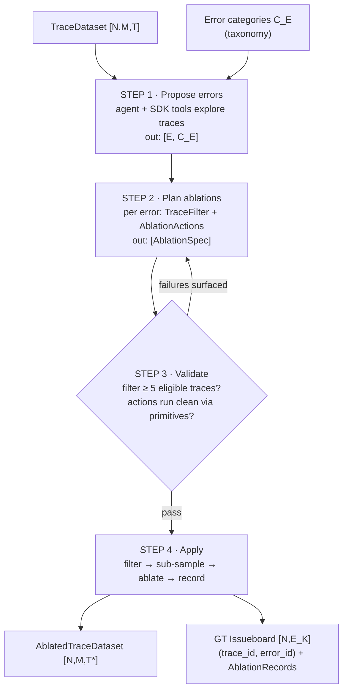
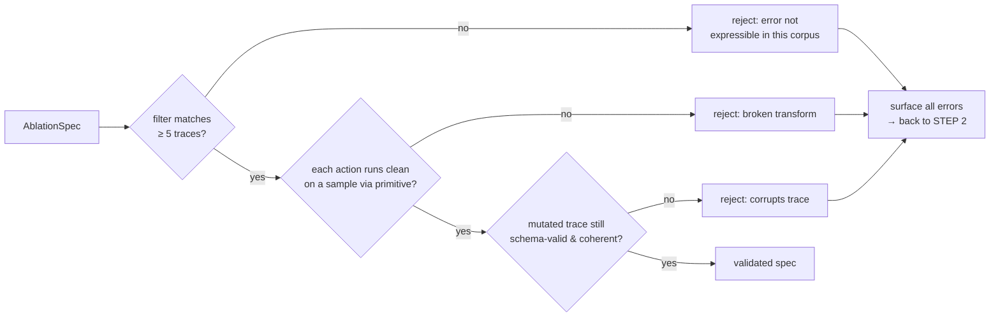
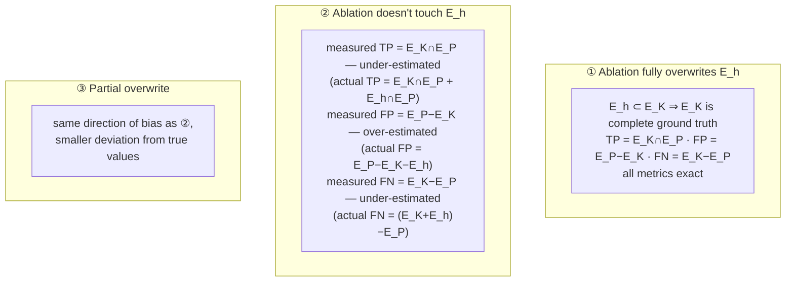

# Stage III — The Ablation Engine

Injects known errors `E` into traces and records the injections as ground truth.

```
[N, M, T]  →  [N, M, T*], [N, E_K]
traces        ablated traces  ground-truth issueboard
```

**Goal**: manufacture ground truth by construction — every injected error is fully known
(what, where, how), so scoring against it is exact.

**Nuance**: input traces may already contain unknown hidden errors `E_h`. Ablations must be
compatible with those (see [bias analysis](#hidden-error-bias-analysis)).

## The four-step loop (base case III.A: traces assumed golden)



### Step 1 — Propose errors from taxonomy + traces

An agent with SDK tools (trace search, span inspection, sampling) explores the trace corpus
and drafts concrete, app-specific errors under each high-level category.

```python
def propose_errors(traces: TraceDataset,
                   categories: list[ErrorCategory],
                   n_per_category: int) -> list[Issue]:
    """in: [N,M,T], C_E → out: [E, C_E]
    Each Issue: {error_id, title, description, category_id, severity∈{low,med,high}}."""
```

Grounding proposals in *real traces of this app* (not a generic error list) is what makes
injected errors plausible — they must look like failures this app could actually produce.

### Step 2 — Plan filter + ablation strategy per error

```python
def plan_ablation(traces: TraceDataset, issue: Issue) -> AblationSpec:
    """in: [N,M,T], [E,C_E] → out: AblationSpec
    - filter: predicate steps over trace properties selecting traces where this
      error CAN plausibly exist (e.g. 'has a tool span', 'retrieval returned docs')
    - ablation_actions: list of str-in → str-out mutations to apply at located fields"""
```

### Step 3 — Validate every spec (the quality gate)



```python
def validate_specs(traces: TraceDataset,
                   specs: list[AblationSpec],
                   min_eligible: int = 5) -> tuple[list[AblationSpec], list[ValidationError]]:
    """Dry-run every spec. Valid specs pass through; failures return to planning."""
```

### Step 4 — Apply and record ground truth

```python
def apply_ablations(traces: TraceDataset,
                    specs: list[AblationSpec],
                    seed: int) -> tuple[TraceDataset, Issueboard, list[AblationRecord]]:
    """in: [N,M,T], E → out: [N,M,T*], [N,E_K]
    For each validated spec:
      1. apply filter               → eligible traces
      2. sub-sample if too large    → target_count traces (seeded RNG)
      3. apply ablation_actions     → mutated copies (originals kept)
      4. store {trace_id, error_id} → IssueOccurrences + AblationRecords (before/after)
    Compound errors: a trace may be selected by >1 spec → carries multiple E_K entries."""
```

Design invariants:

- **Originals are immutable** — ablation writes a new dataset with `parent_dataset_id` set.
- **Full audit trail** — every mutation stores its before/after strings.
- **Leak-proofing** — the copy shipped to Engine strips `ablation_ids`, `AblationRecord`s,
  and any field ordering/formatting artifacts that would fingerprint ablated traces.
- **Controlled prevalence** — sub-sampling sets the injection rate per error; some traces
  are left clean on purpose (Engine predicting issues on clean traces = false positives).

## Hidden-error bias analysis (III.B)

Traces already carry unlabeled errors `E_h`. After ablation, the true error set is
`E_h + E_K`, but scoring only knows `E_K`. Three regimes, by how much ablation overwrites
the hidden errors:



| Measured quantity | vs. truth | Why |
|---|---|---|
| True positives `E_K ∩ E_P` | under-estimate | Engine's hits on `E_h` aren't credited |
| False positives `E_P − E_K` | over-estimate | `E_h` hits are miscounted as FP |
| False negatives `E_K − E_P` | under-estimate | misses on `E_h` are invisible |

**Conclusions** (from the notes, kept as system principles):

1. Ablation-based ground truth is a **biased estimator** of Engine's performance — expected
   and acceptable, because the bias direction is known (measured precision is a *lower
   bound* on true precision w.r.t. all real issues).
2. The only foolproof way to find `E_h` is **expert annotation**; ablations improve
   continually as annotations reveal previously hidden errors (fold them into `C_E`).
3. Bias magnitude is a direct function of how many `E_h` ablation misses — reducible by
   spending more test-time compute and widening ablation hyperparameters (more categories,
   more proposals per category, overwrite-style ablations that replace regions where `E_h`
   could live).
