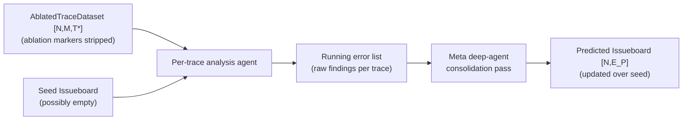
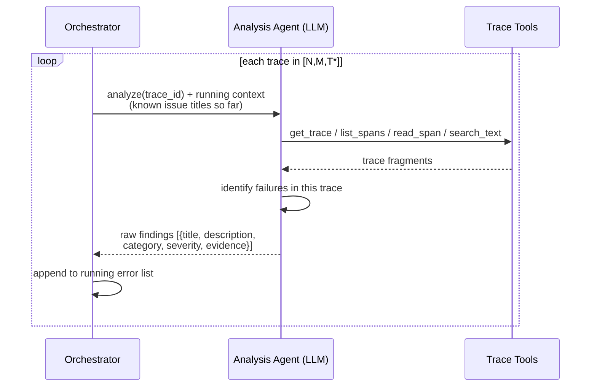
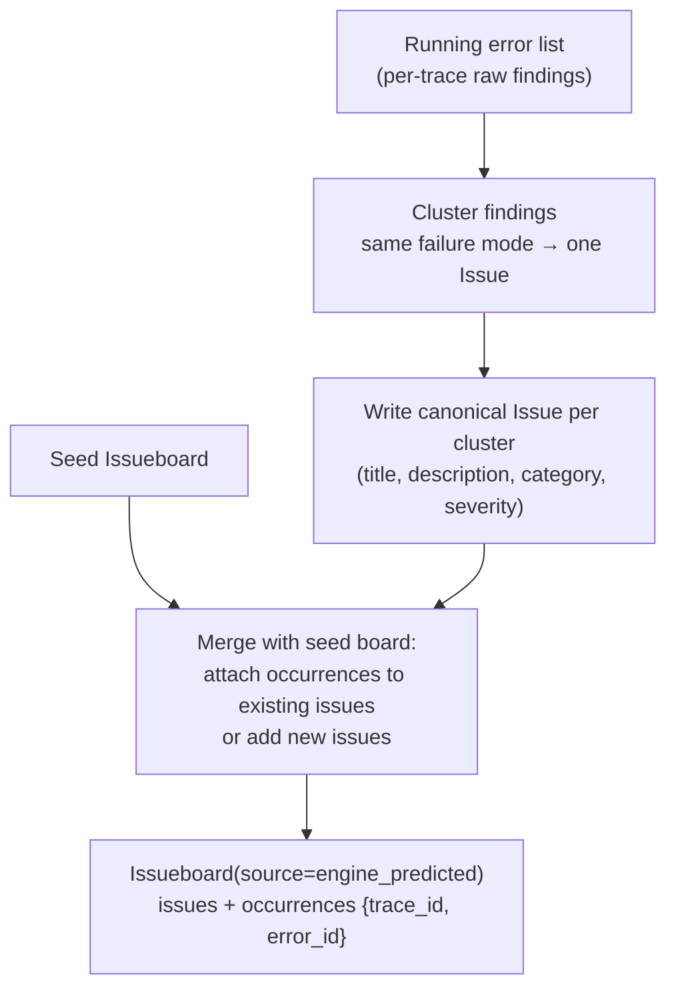
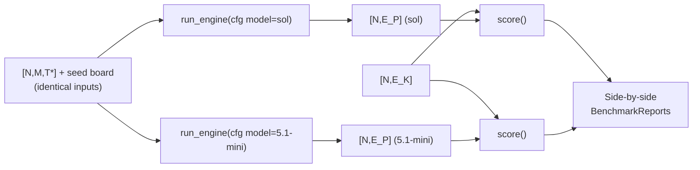

# Stage IV — Engine Under Test (Simulated)

Real Engine isn't available to run, so a **coding agent with custom instructions** simulates
it: a prompt-based deep-agent with tool-call access and instructions on how to report errors.

```
[N, M, T*]  →  [N, E_P]
ablated traces   predicted issueboard
```

The simulated Engine is a *benchmark consumer*, not part of the benchmark itself — anything
that reads the trace JSON and emits an issueboard in the schema can be scored. This is what
makes the model comparison (Sol vs 5.1-mini) a drop-in swap.

## High-level flow



```python
class EngineConfig(BaseModel):
    model: str                       # "sol" | "5.1-mini" | ...
    system_prompt: str               # the 'custom instructions' simulating Engine
    tools: list[str]                 # trace-inspection tool names exposed to the agent
    max_tool_calls_per_trace: int
    seed: int

def run_engine(traces: TraceDataset, seed_board: Issueboard,
               cfg: EngineConfig) -> Issueboard:
    """[N,M,T*] → [N,E_P]. Sequential per-trace analysis + meta consolidation."""
```

## Atomic view: per-trace analysis pass

Runs sequentially on every trace, maintaining a running list of raw findings.



```python
def analyze_trace(trace: Trace, running_titles: list[str],
                  cfg: EngineConfig) -> list[RawFinding]:
    """One trace → zero or more raw findings (unconsolidated)."""

class RawFinding(BaseModel):
    trace_id: str
    title: str
    description: str
    category_id: str
    severity: Literal["low", "medium", "high"]
    evidence: str                    # cited span/snippet
```

## Atomic view: meta consolidation pass

A second deep-agent pass clusters raw findings into issues — mirroring real Engine's
"identify clusters of issues" behavior — and merges with the seed board.



```python
def consolidate(findings: list[RawFinding], seed_board: Issueboard,
                cfg: EngineConfig) -> Issueboard:
    """Cluster raw findings into canonical Issues, merge over the seed board,
    emit occurrences — the {trace_id, error_id} matrix scoring consumes."""
```

## Model comparison harness (Sol vs 5.1-mini)

The assignment's final question is answered by running the identical benchmark twice:



Everything except `EngineConfig.model` is held constant (same prompt, tools, seed, traces),
so report deltas are attributable to the model.

## Anti-leak guarantees (what the simulated Engine must NOT see)

- `ablation_ids`, `AblationRecord`s, ground-truth issueboard — stripped before Stage IV.
- The `C_E` taxonomy given to Engine's prompt is the **public category vocabulary only**
  (category names/descriptions), never the concrete injected error definitions.
- No access to the original (pre-ablation) traces — diffing them would trivially reveal
  every injection.
