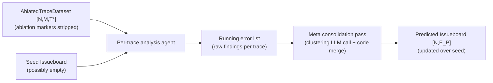
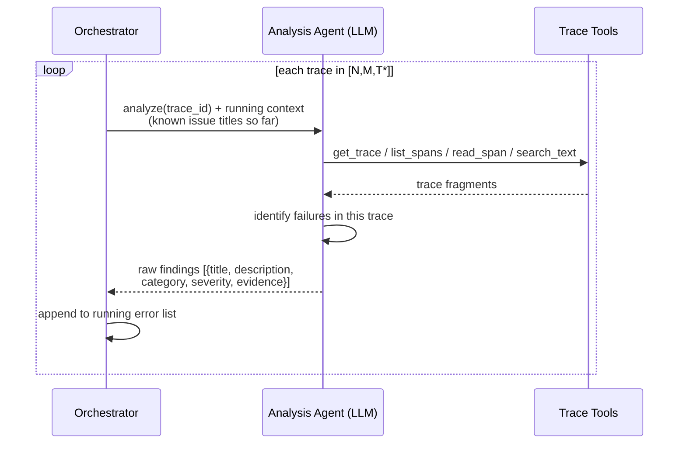
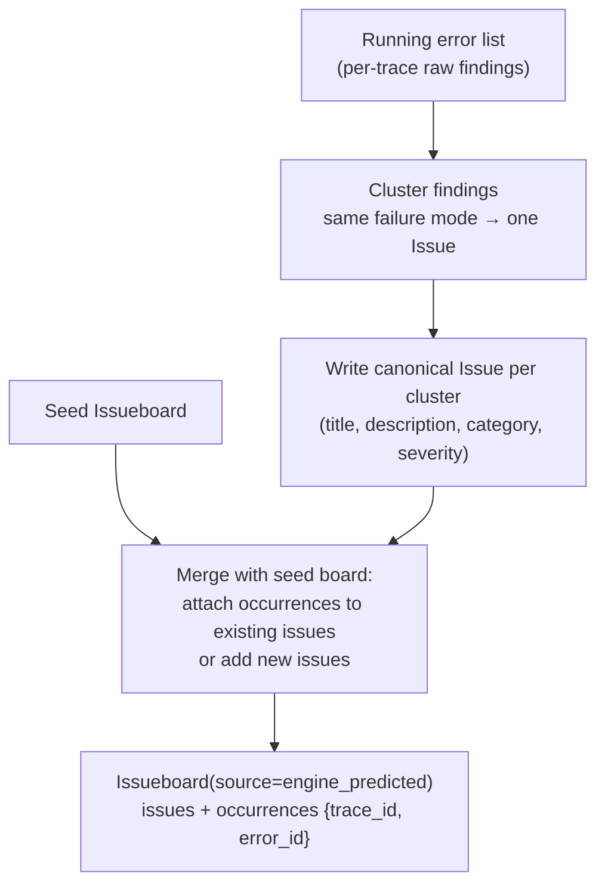
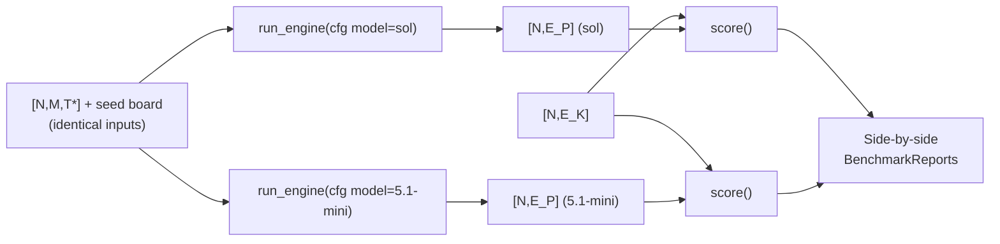

# Stage IV — Engine Under Test (Simulated)

Real Engine isn't available to run, so a **coding agent with custom instructions** simulates
it: an LLM with tool-call access and instructions on how to report errors, orchestrated by
custom loop code rather than an agent scaffold.

```
[N, M, T*]  →  [N, E_P]
ablated traces   predicted issueboard
```

The simulated Engine is a *benchmark consumer*, not part of the benchmark itself — anything
that reads the trace JSON and emits an issueboard in the schema can be scored. This is what
makes the model comparison (Sol vs 5.1-mini) a drop-in swap.

**v0 implementation note — shipped as a deterministic `StateGraph`, not `deepagents`.**
`apps/engine` is a plain LangGraph `StateGraph` loop (`load → analyze → consolidate → END`,
with `analyze` looping over itself once per batch), not a `deepagents`-scaffolded agent. This
mirrors the Phase 2 decision on the target app: `deepagents`' scaffold keeps filesystem and
shell tools registered on the `ToolNode` even when hidden from the model, and this agent
spends its life reading attacker-influenced text out of traces, so a tool it can be *talked
into* calling is a tool it must not have. The analysis agent's dispatchable surface is
exactly **four read-only trace tools** — `get_trace`, `list_spans`, `read_span`,
`search_text` — asserted by `tests/test_tool_registry.py` in `apps/engine`.

## High-level flow



```python
class EngineConfig(BaseModel):
    model: str                       # "sol" | "5.1-mini" | ...
    system_prompt: str               # the 'custom instructions' simulating Engine
    tools: list[str]                 # trace-inspection tool names exposed to the agent
    max_tool_calls_per_trace: int
    seed: int

def run_engine(traces: TraceDataset, seed_board: Issueboard,
               cfg: EngineConfig) -> Issueboard:
    """[N,M,T*] → [N,E_P]. Batched-parallel per-trace analysis + meta consolidation."""
```

## Atomic view: per-trace analysis pass

**v0 implementation note — batched-parallel, not strictly sequential.** The conceptual
"runs sequentially on every trace" model below is what N=1 reduces to exactly. The shipped
`analyze` node processes traces in **batches of `analysis_concurrency` traces at once**
(`config.configurable["analysis_concurrency"]`, default **8**, clamped to 1–16;
`$ENGINE_ANALYSIS_CONCURRENCY` sets a global default) via a thread pool — sequential
per-trace analysis over 300 traces projects to over two hours, which does not fit the
assignment's scale. The batch is deliberately the unit of shared context, not just
parallelism:

- Every trace in a batch analyzes against the **same snapshot** of running issue titles,
  taken before the batch starts; titles the batch discovers are **merged in only between
  batches**, never within one. A trace seeing whatever its batchmates had already finished
  would make the analysis depend on thread scheduling, and two runs over the same corpus
  would stop being comparable.
- Findings are assembled in **input trace order**, not completion order, so the run's board
  is byte-identical at N=1, 3, and 8 given the same per-trace results — **N=1 reproduces the
  fully sequential model exactly**.
- A per-trace analysis failure is isolated to its own worker and does not cost its batch or
  the run; failures are logged and counted toward a run-wide failure-rate gate (the
  consolidate step refuses to emit a board past a configured failure-rate threshold, since at
  that point "the Engine found little" and "the Engine barely ran" must not reach scoring
  wearing the same shape).



```python
def analyze_trace(trace: Trace, running_titles: list[str],
                  cfg: EngineConfig) -> list[RawFinding]:
    """One trace → zero or more raw findings (unconsolidated)."""

class RawFinding(BaseModel):
    trace_id: str
    title: str
    description: str
    category_id: str
    severity: Literal["low", "medium", "high"]
    evidence: str                    # cited span/snippet
```

**v0 implementation note — required predictions, no defaults (evaluation-integrity
decision).** `category_id` and `severity` carry **no default** on the LLM-facing extraction
schema; the provider's structured-output mode forces the model to predict them, and a
response missing either field fails validation into the counted failure path rather than
becoming a silently-defaulted finding. The rationale: a default would make silence a
scoreable answer, and the benchmark would end up grading the default's luck against the
ground-truth distribution instead of the model's actual judgement — the opposite of what a
benchmark is for. `trace_id` is intentionally *not* on this schema at all — the orchestrator
already knows which trace it asked about and stamps it, so a finding cannot be
mis-attributed to the wrong trace even accidentally. Guarded by
`tests/test_no_defaulted_predictions.py` in `apps/engine`, which asserts directly on the
generated JSON schema.

## Atomic view: meta consolidation pass

A second LLM pass clusters raw findings into issues — mirroring real Engine's "identify
clusters of issues" behavior — and merges with the seed board. **v0 implementation note**:
the LLM decides clustering only; `assemble_board` then performs the merge in pure code so the
benchmark's invariants (one issue per failure mode, each finding claimed by exactly one
cluster, one occurrence per `(issue, trace)` pair, seed issues gaining occurrences rather
than duplicates) hold regardless of what the model returns. For corpora too large for one
clustering call, findings are clustered in batches and reunited across batches — identically
named clusters folded in code, a bounded second-stage pass over cluster summaries catching
differently-worded duplicates — with every LLM call on this path retried once and then
falling back to deterministic grouping, so no batch failure costs more than that batch's
clustering.



```python
def consolidate(findings: list[RawFinding], seed_board: Issueboard,
                cfg: EngineConfig) -> Issueboard:
    """Cluster raw findings into canonical Issues, merge over the seed board,
    emit occurrences — the {trace_id, error_id} matrix scoring consumes."""
```

## Model comparison harness (Sol vs 5.1-mini)

The assignment's final question is answered by running the identical benchmark twice:



Everything except `EngineConfig.model` is held constant (same prompt, tools, seed, traces),
so report deltas are attributable to the model. **v0 implementation note**: the model swap
goes through `config.configurable[model_configurable_key]` (`configs/engine.yaml` names the
key `model`), read server-side and confirmed by readback of the persisted run config rather
than trusted from the outgoing request — a silently-ignored model override would otherwise
produce two byte-identical boards that look like agreement instead of a broken comparison.

## Invocation surface (what Phase 7 sends)

**v0 implementation note.** The run input is `{trace_file, seed_issueboard, categories}` —
`trace_file` is a **path** the LangGraph server can read, not an inline trace payload (a
300-trace corpus re-serialized into checkpointed graph state on every superstep would be
wasteful); `categories` is the public vocabulary (names + descriptions, including `other`).
`config.configurable` carries the comparison axis (`model`) and the speed knob
(`analysis_concurrency`); `config.recursion_limit` must be set explicitly by the caller —
the loop runs `2 + ceil(n_traces / analysis_concurrency)` supersteps, which exceeds
LangGraph's default recursion limit (25) well before 300 traces at the default
concurrency of 8.

The run's output *is* the issueboard: `{board_id, source: "engine_predicted", issues,
occurrences}` validates directly as `Issueboard` with no unwrapping. **`board_id` must be
re-stamped by the consumer, not trusted as-is** — it is a content hash of the same shape as
the benchmark's own `content_hash` helper, but computed over a different canonical JSON
(the Engine's `Issue` model does not carry the benchmark's `injection_mode` field, so the
two hashes differ for what is otherwise an identical board). Treat the Engine's `board_id` as
the Engine's own label, not as a benchmark dataset id — Phase 7 recomputes it after parsing
into `benchmark.schemas.issues.Issueboard`.

## Anti-leak guarantees (what the simulated Engine must NOT see)

- `ablation_ids`, `AblationRecord`s, ground-truth issueboard — stripped before Stage IV.
- The `C_E` taxonomy given to Engine's prompt is the **public category vocabulary only**
  (category names/descriptions), never the concrete injected error definitions.
- No access to the original (pre-ablation) traces — diffing them would trivially reveal
  every injection.
