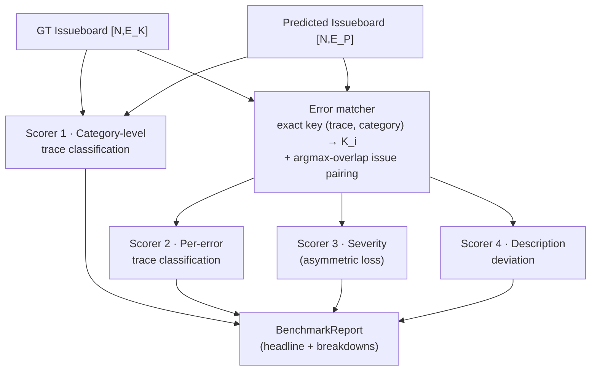
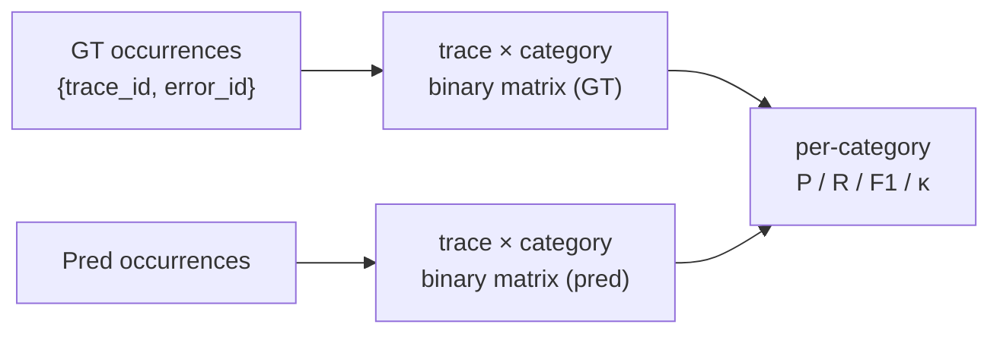
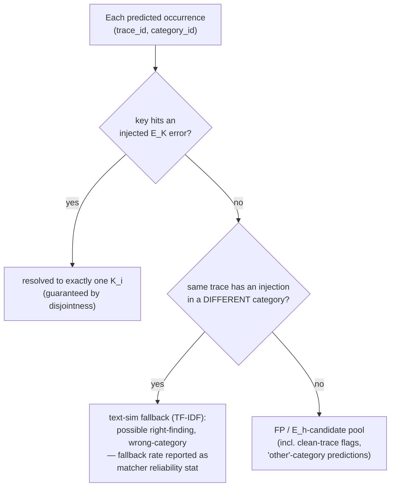
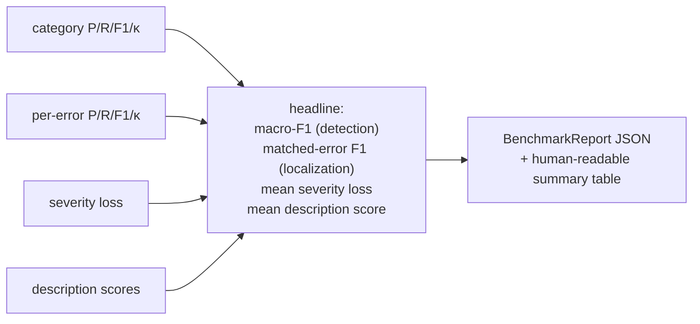

# Stage V — Scorers & Benchmark Report

```
{ [N, E_K], [N, E_P] }  →  BenchmarkReport
  ground truth  predicted     benchmark numbers
```

Scoring works at increasing resolution: **category-level detection** (no matching needed) →
**error-level matching** (map `E_P → E_K`) → **per-error classification, severity, and
description quality** (matched pairs only). The assignment scopes scoring to the issueboard
itself — proposed fixes are out of scope.

## High-level flow



```python
def score(ground_truth: Issueboard, predicted: Issueboard,
          traces: TraceDataset, cfg: ScoringConfig) -> BenchmarkReport: ...
```

## Scorer 1 — Category-level trace classification

Before any error matching: for each category `c ∈ C_E`, treat "trace has an issue of
category c" as a binary label per trace, computed from occurrences.

```python
def score_categories(gt: Issueboard, pred: Issueboard,
                     trace_ids: list[str]) -> list[CategoryScore]:
    """Per-category precision, recall, F1, Cohen's kappa over the
    (trace × category) binary matrix. Kappa corrects for chance agreement —
    important when injection prevalence per category is low."""
```



This scorer is deliberately **matching-free**: it rewards Engine for detecting the right
*kind* of problem on the right traces even when its error write-ups don't align 1:1 with
the injected definitions.

## Error matcher — mapping `E_P → E_K`

Matching is **exact bookkeeping, not fuzzy text similarity** — a direct payoff of the
ablation engine's [same-category disjointness invariant](04-ablation-engine.md): since two
errors of one category are never injected into the same trace, **`(trace_id, category_id)`
uniquely identifies the injected known error**. Matching happens in two layers.

### Layer 1 — occurrence-level resolution (exact key)



```python
def resolve_occurrences(gt: Issueboard, pred: Issueboard) -> list[OccurrenceMatch]:
    """Exact-key resolution: predicted occurrence (trace_id, category_id) → the one
    known error injected under that key, or fallback/unmatched. No thresholds on
    the primary path; text similarity only fires for wrong-category cases and its
    firing rate is itself reported (matcher reliability)."""
```

### Layer 2 — issue-level pairing (argmax overlap / "majority vote")

Scorers 3–4 compare issue *objects* (severity vs severity, write-up vs write-up), so each
predicted issue needs one known-error partner. Its resolved occurrences decide:

```
matched(P_j) = argmax_{K_i ∈ same category} | occurrences(P_j) ∩ traces(K_i) |
```

Well-posed because the `K_i` trace sets partition the ablated traces: a coherent predicted
cluster concentrates overlap on one `K_i`; a lumped cluster dilutes itself. Ties break by
text similarity between descriptions (the only other place TF-IDF re-enters).

```python
def pair_issues(occ_matches: list[OccurrenceMatch],
                gt: Issueboard, pred: Issueboard) -> list[ErrorMatch]:
    """Per predicted issue: argmax over known errors of occurrence-set overlap.
    Many-to-one predicted→known allowed; the reverse is structurally excluded."""
```

### Granularity asymmetry (by design)

- **Predicted finer than known — fine.** Two predicted issues splitting one `K_i` both
  argmax to it: both keep occurrence credit, both are description-scored against `K_i`.
- **Predicted coarser than known — penalized where it hurts.** A cluster lumping `K_1, K_2`
  pairs with only its majority partner; its write-up scores poorly as a description of one
  specific error, and the minority known error is left without an issue-level partner.
  Occurrence-level detection credit stays fair throughout.

### Future work

- **Weak supervision** (multiple labeling functions over traces) as the upgrade path for
  the wrong-category text fallback — the exact-key primary path needs no upgrade.
- **Cluster purity metric** (homogeneity of resolved known-error labels within each
  predicted issue) to penalize under-splitting directly; drops out of Layer 1 for free.
- **Net-new-category expansion**: hide category definitions from Engine, perform a
  category-level alignment (predicted free-form category → `C_E`) before scorer 1, then run
  all downstream measures unchanged. v1 sticks to the known shared taxonomy plus an
  **`other` escape category** so Engine is never forced to shoehorn genuine out-of-taxonomy
  (`E_h`) discoveries — `other` predictions flow straight to the `E_h`-candidates appendix.

## Scorer 2 — Per-error trace classification

Once `E_P → E_K` is mapped: for each matched error, compare its occurrence sets ("which
traces did you say exhibit this error?").

```python
def score_per_error(gt: Issueboard, pred: Issueboard,
                    occ_matches: list[OccurrenceMatch]) -> list[CategoryScore]:
    """Per known error K_i: precision, recall, F1, Cohen's kappa over trace sets,
    computed from Layer-1 exact-key resolutions (independent of issue pairing).
    This is the strictest localization test: right error, right traces."""
```

## Scorer 3 — Severity classification (asymmetric loss)

Under-predicting severity is worse than over-predicting (a missed high-severity issue costs
more than a false alarm):

```
loss(actual, predicted) = (actual − predicted)²   if predicted < actual   (quadratic)
                        = α·(predicted − actual)  if predicted > actual   (sloped linear, α<1)
severity ordinal: low=0, medium=1, high=2
```

```python
def score_severity(matches: list[ErrorMatch], gt: Issueboard,
                   pred: Issueboard, alpha: float = 0.5) -> float:
    """Mean asymmetric loss over matched pairs. 0 = perfect. Reported alongside
    a severity confusion matrix for interpretability."""
```

## Scorer 4 — Description deviation

For matched pairs, does Engine's write-up actually describe the injected failure?

```python
def score_descriptions(matches: list[ErrorMatch], gt: Issueboard, pred: Issueboard,
                       mode: Literal["similarity", "judge"] = "judge") -> dict[str, float]:
    """similarity: embedding cosine between descriptions (cheap, gameable)
    judge: LLM rubric — {identifies same root cause? same failure surface?
    actionable?} → per-pair score in [0,1] + failure-mode tag with pass/fail."""
```

## Composite report



Headline numbers are reported **separately, not collapsed into one scalar** — detection,
localization, severity calibration, and explanation quality fail independently and a single
composite hides which one regressed. (A weighted composite can be added for leaderboard
purposes, weights in `ScoringConfig`.)

## Interpreting numbers under hidden-error bias

Per the [ablation bias analysis](04-ablation-engine.md#hidden-error-bias-analysis):

- Reported **precision is a lower bound** — some "false positives" may be genuine `E_h`
  discoveries. The report surfaces unmatched high-confidence predictions as an
  `E_h candidates` appendix for human review rather than silently penalizing them.
- Reported **recall is exact w.r.t. `E_K`** (the injected set), which is the quantity the
  benchmark controls.
