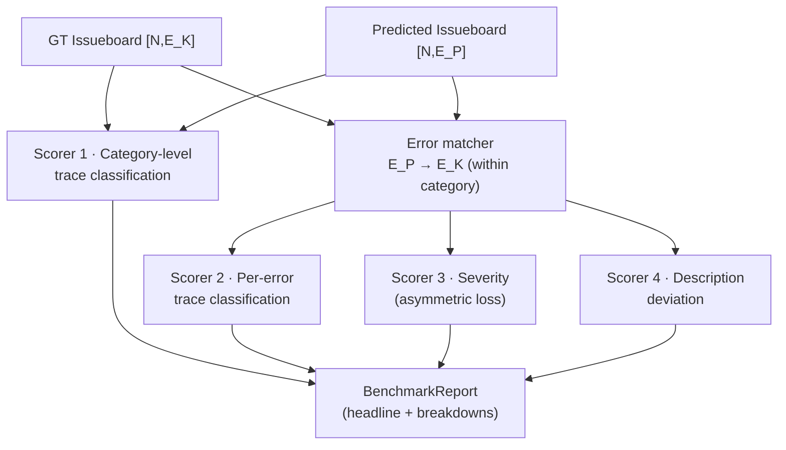
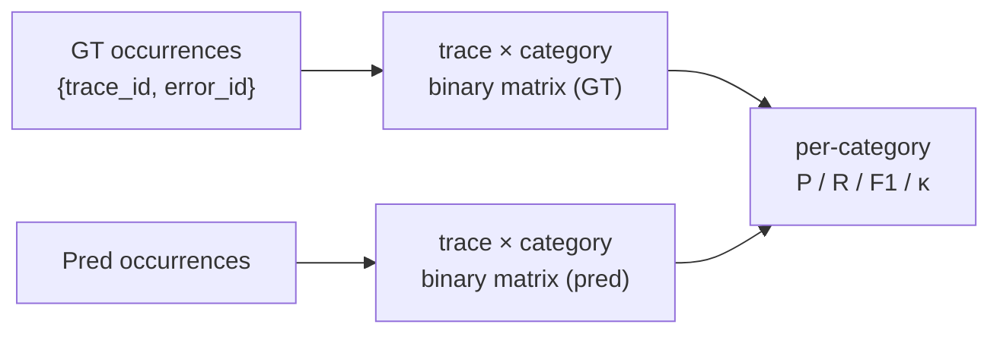
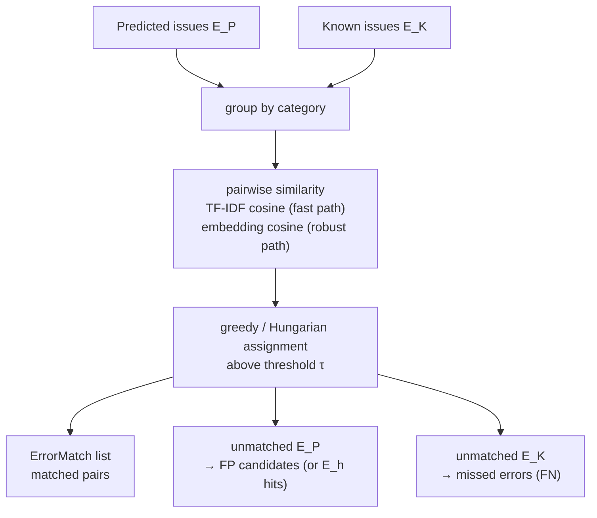
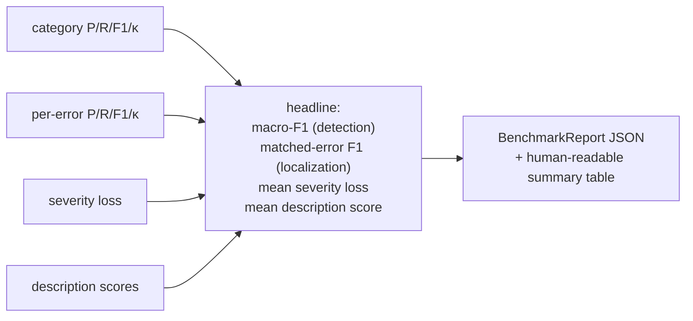

# Stage V — Scorers & Benchmark Report

```
{ [N, E_K], [N, E_P] }  →  BenchmarkReport
  ground truth  predicted     benchmark numbers
```

Scoring works at increasing resolution: **category-level detection** (no matching needed) →
**error-level matching** (map `E_P → E_K`) → **per-error classification, severity, and
description quality** (matched pairs only). The assignment scopes scoring to the issueboard
itself — proposed fixes are out of scope.

## High-level flow



```python
def score(ground_truth: Issueboard, predicted: Issueboard,
          traces: TraceDataset, cfg: ScoringConfig) -> BenchmarkReport: ...
```

## Scorer 1 — Category-level trace classification

Before any error matching: for each category `c ∈ C_E`, treat "trace has an issue of
category c" as a binary label per trace, computed from occurrences.

```python
def score_categories(gt: Issueboard, pred: Issueboard,
                     trace_ids: list[str]) -> list[CategoryScore]:
    """Per-category precision, recall, F1, Cohen's kappa over the
    (trace × category) binary matrix. Kappa corrects for chance agreement —
    important when injection prevalence per category is low."""
```



This scorer is deliberately **matching-free**: it rewards Engine for detecting the right
*kind* of problem on the right traces even when its error write-ups don't align 1:1 with
the injected definitions.

## Error matcher — mapping `E_P → E_K`

Within each category, predicted errors are matched to known errors by text similarity over
`title + description`.



```python
def match_errors(known: list[Issue], predicted: list[Issue],
                 method: Literal["tfidf", "embedding"] = "tfidf",
                 threshold: float = 0.5) -> list[ErrorMatch]:
    """Within-category, one-to-one assignment maximizing total similarity.
    Unmatched predictions stay as candidate FPs; unmatched knowns are FNs."""
```

Category grouping keeps the assignment problem small and prevents cross-category
false-matches (a hallucination error should never match a latency error however similar the
wording).

## Scorer 2 — Per-error trace classification

Once `E_P → E_K` is mapped: for each matched error, compare its occurrence sets ("which
traces did you say exhibit this error?").

```python
def score_per_error(gt: Issueboard, pred: Issueboard,
                    matches: list[ErrorMatch]) -> list[CategoryScore]:
    """Per matched error: precision, recall, F1, Cohen's kappa over trace sets.
    This is the strictest localization test: right error, right traces."""
```

## Scorer 3 — Severity classification (asymmetric loss)

Under-predicting severity is worse than over-predicting (a missed high-severity issue costs
more than a false alarm):

```
loss(actual, predicted) = (actual − predicted)²   if predicted < actual   (quadratic)
                        = α·(predicted − actual)  if predicted > actual   (sloped linear, α<1)
severity ordinal: low=0, medium=1, high=2
```

```python
def score_severity(matches: list[ErrorMatch], gt: Issueboard,
                   pred: Issueboard, alpha: float = 0.5) -> float:
    """Mean asymmetric loss over matched pairs. 0 = perfect. Reported alongside
    a severity confusion matrix for interpretability."""
```

## Scorer 4 — Description deviation

For matched pairs, does Engine's write-up actually describe the injected failure?

```python
def score_descriptions(matches: list[ErrorMatch], gt: Issueboard, pred: Issueboard,
                       mode: Literal["similarity", "judge"] = "judge") -> dict[str, float]:
    """similarity: embedding cosine between descriptions (cheap, gameable)
    judge: LLM rubric — {identifies same root cause? same failure surface?
    actionable?} → per-pair score in [0,1] + failure-mode tag with pass/fail."""
```

## Composite report



Headline numbers are reported **separately, not collapsed into one scalar** — detection,
localization, severity calibration, and explanation quality fail independently and a single
composite hides which one regressed. (A weighted composite can be added for leaderboard
purposes, weights in `ScoringConfig`.)

## Interpreting numbers under hidden-error bias

Per the [ablation bias analysis](04-ablation-engine.md#hidden-error-bias-analysis):

- Reported **precision is a lower bound** — some "false positives" may be genuine `E_h`
  discoveries. The report surfaces unmatched high-confidence predictions as an
  `E_h candidates` appendix for human review rather than silently penalizing them.
- Reported **recall is exact w.r.t. `E_K`** (the injected set), which is the quantity the
  benchmark controls.
