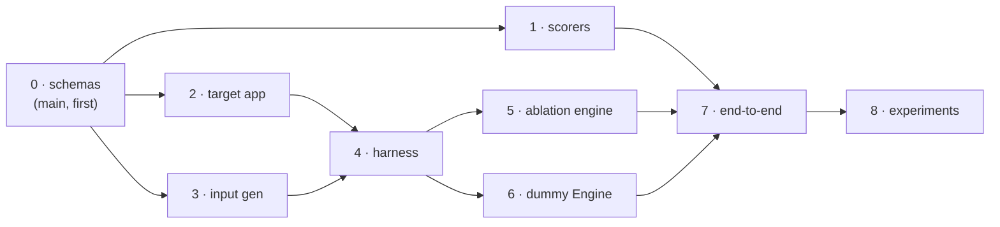

# Execution Plan

Implementation plan for the system described in [docs/architecture/](architecture/00-overview.md).
Each phase runs in its own worktree; phases in the same batch can run as parallel coding
sessions.

## Ground rules

1. **One phase = one worktree.** Parallel batches → parallel sessions.
2. **Python backend**; OpenAI models wherever an LLM is needed.
3. **LangGraph primitives everywhere they fit**: LangSmith for tracing, LangChain
   deep-agents for the target app and the dummy Engine, LangGraph Server (`langgraph.json`)
   as the invocation surface, LangGraph checkpoint time-travel for replay.
4. **Black-box boundary (hard rule)**: the target AI app and the Engine live in their own
   subdirectories as self-contained codebases. Benchmark code NEVER imports from them —
   everything it knows about either comes from a **config file**, and everything it does to
   either goes through the **LangGraph Server API / SDK**. Enforced by an import-boundary
   test in CI.
5. **No OpenAI calls in unit tests.** LLM-dependent behavior sits behind interfaces and is
   mocked; live-model tests are small, explicit, and manually triggered.

## Repository layout

```
engine-benchmarking-system/
├── apps/
│   ├── target_app/          # self-contained: own pyproject, langgraph.json,
│   │   └── ...              #   deep-agent, RAG store, shim hooks
│   └── engine/              # self-contained dummy Engine: own pyproject,
│       └── ...              #   langgraph.json, trace tools, consolidation
├── benchmark/               # the system we're building — never imports apps/
│   ├── schemas/             # Phase 0: all Pydantic models + dataset I/O
│   ├── scoring/             # Phase 1
│   ├── generation/          # Phase 3
│   ├── harness/             # Phase 4
│   ├── ablation/            # Phase 5
│   ├── pipeline/            # Phase 7
│   └── models.py            # single place OpenAI model ids are pinned
├── configs/
│   ├── target_app.yaml      # the ONLY thing benchmark knows about the app
│   ├── engine.yaml          # the ONLY thing benchmark knows about Engine
│   ├── generation/*.yaml    # GenerationConfigs
│   └── taxonomy.yaml        # C_E categories (incl. "other")
├── docs/
└── tests/
```

## The black-box contract (config-only interface)

Both apps are **LangGraph apps served via `langgraph.json`** (`langgraph dev` locally).
The benchmark drives them exclusively through `langgraph_sdk` against a URL from config.

```yaml
# configs/target_app.yaml
base_url: "http://127.0.0.1:2024"
assistant_id: "target_app"
langsmith_project: "engine-bench-target"     # where its traces land
fault_configurable_keys:                     # declared shim surface (Mode C)
  retriever: "fault_retriever"               #   values passed via run config.configurable
  tool: "fault_tool"
  llm: "fault_llm"
max_turns_supported: 8
```

```yaml
# configs/engine.yaml
base_url: "http://127.0.0.1:2025"
assistant_id: "engine"
model_configurable_key: "model"              # the Sol vs mini swap goes through here
```

How each architecture requirement maps onto LangGraph surfaces:

| Requirement (arch docs) | LangGraph surface |
|---|---|
| Invoke target app per input | `client.runs.wait(thread_id, assistant_id, input=...)` |
| Multi-turn conversations | one thread per conversation, sequential runs |
| **Mode A replay** ("continue from a corrupted turn k") | **checkpoint time-travel**: fork the thread at the checkpoint before turn k, `update_state` with the corrupted content, resume runs from the fork |
| **Mode C fault arming** (shims, no code coupling) | fault configs passed as `config.configurable[<declared key>]` on the run; app-side shim hooks read them; benchmark only knows the key names from `target_app.yaml` |
| Trace collection | LangSmith SDK, filtered by project + run metadata (`session_id`), normalized into our `Trace` schema |
| Engine invocation | same SDK against `engine.yaml`; input = trace file path/dataset ref + seed issueboard, output = predicted issueboard JSON |
| Sol vs 5.1-mini swap | `config.configurable[model_configurable_key]` — no Engine code change |

Notes:
- The stateless client-supplied-history contract from `04-ablation-engine.md` is **subsumed
  by checkpoint time-travel** — forking at a checkpoint with edited state is the same
  capability with a cleaner primitive. `03-trace-harness.md` / `04-ablation-engine.md` get a
  small update when Phase 2/4 land.
- Engine sees only: the leak-stripped trace file, the seed issueboard, and the category
  vocabulary (names + descriptions, incl. `other`). Nothing else crosses the boundary.

## Tracing backend: LangSmith in v0, our schema as the contract (future work)

The assignment explicitly asks for the right **trace data structure**, and the architecture
docs define one (`Trace/Turn/Span`). That schema — not LangSmith's — is the system's
contract:

- **v0**: LangSmith is the *collection* backend (fastest path off the ground). The Phase 4
  collector normalizes LangSmith run trees into our `Trace` schema and writes them to a
  local filesystem **`TraceStore`**.
- **Boundary rule**: everything downstream of collection — ablation engine, dummy Engine
  inputs, scoring, pipeline — reads and writes traces **only through the `TraceStore`
  interface** (our schema, local JSON). No LangSmith types or SDK calls south of the
  collector.
- **Future work**: swap the collection side to write our schema directly (e.g. an OTel/
  callback exporter in the target app config) and drop LangSmith entirely. Because the
  boundary already exists, this replaces one collector implementation and nothing else.

## Model pinning (`benchmark/models.py` + app configs)

| Role | Tier | Where configured |
|---|---|---|
| Target app | small/fast (low latency, ≤2 tool calls) | `apps/target_app` config |
| Input generation LLM-expansion | mid-tier | `benchmark/models.py` |
| Persona user-simulator | mid-tier | `benchmark/models.py` |
| Ablation agents (propose/plan/rewrite) | mid-tier | `benchmark/models.py` |
| Engine under test | **the comparison axis** (large vs mini) | run config at invocation |
| Description-deviation judge (scorer 4) | mid-tier, mocked in unit tests | `benchmark/models.py` |

Concrete model ids get pinned in code at Phase 0 and never scattered.

---

# Phases

## Phase 0 — Shared contract package

**Worktree:** `phase-0-schemas` (lands on main before parallel work begins) · **Deps:** none

The schemas are the merge-conflict magnet — every later phase imports them, so they land
first and completely.

Deliverables:
- Repo scaffolding: uv/pyproject workspace, pytest, ruff, CI script.
- `benchmark/schemas/`: every model from [01-data-schemas.md](architecture/01-data-schemas.md)
  — `Trace/Turn/Span`, `InputSpec/Dimension/Persona/InputDataset`,
  `Issue/IssueOccurrence/Issueboard/ErrorCategory`,
  `AblationSpec/FaultConfig/AblationRecord/AblationSplit`,
  `OccurrenceMatch/ErrorMatch/CategoryScore/BenchmarkReport`, config models
  (`GenerationConfig`, `TargetAppConfig`, `EngineAppConfig`, `ScoringConfig`).
- Dataset I/O: JSON read/write, content-hash `dataset_id`, `parent_dataset_id` lineage.
- **`TraceStore` boundary**: protocol + `LocalTraceStore` (filesystem, our `Trace` schema)
  — the replaceable seam that keeps LangSmith on the collection side only (see
  "Tracing backend" above).
- Import-boundary test: `benchmark/` must not import `apps/*` (fails CI if violated).

**Gate:**
- [ ] All schemas round-trip serialize/deserialize with validation.
- [ ] Lineage helpers unit-tested.
- [ ] Boundary test in CI and passing.

## Phase 1 — Scorers

**Worktree:** `phase-1-scorers` · **Deps:** Phase 0 · **Batch A (parallel with 2, 3)**

No dummy traces: `E_K`/`E_P` fixtures are pure IDs (issue ids, category ids, trace ids),
which fits the exact-key matcher — the primary path never touches text. Text fixtures are
used only where text genuinely enters.

Deliverables ([06-scoring.md](architecture/06-scoring.md)):
- Layer 1: exact-key `(trace_id, category_id)` occurrence resolution + wrong-category
  TF-IDF fallback + FP/`E_h`-candidate pool (incl. `other`-category routing).
- Layer 2: argmax-overlap issue pairing, text-similarity tiebreak.
- Scorer 1 (category P/R/F1/κ), Scorer 2 (per-error from Layer-1 resolutions),
  Scorer 3 (asymmetric severity: quadratic under / α-linear over),
  Scorer 4 (description deviation: TF-IDF mode + LLM-judge mode behind an interface,
  judge mocked in tests).
- `BenchmarkReport` assembly incl. `base_rates`, `matcher_fallback_rate`, `E_h` appendix.

**Gate:**
- [ ] Unit tests cover: disjointness-derived unique keys; fallback firing + rate reporting;
      granularity asymmetry (finer-than-known free, coarser-than-known punished via
      pairing + description); tie-break path; severity loss shape; κ at low prevalence.
- [ ] Golden-report test: hand-computed tiny E_K/E_P pair asserted field-by-field.

## Phase 2 — Target AI app

**Worktree:** `phase-2-target-app` · **Deps:** Phase 0 · **Batch A**

A `apps/target_app/` deep-agent on a small OpenAI model. Domain: pick something RAG-natural
(e.g. product-support assistant over a small local doc store). **≤2 tools**: one RAG
retrieval tool, one action tool (`create_ticket` stub) — low latency for high-volume I/O.

Deliverables:
- Deep-agent graph + `langgraph.json`; runs under `langgraph dev`; LangSmith tracing on.
- **Checkpointing enabled** — required for thread time-travel (the Mode A surface).
- **Shim hooks** (Mode C surface): retriever shim (irrelevant/empty/stale docs), tool
  wrapper (error/timeout/corrupted result), LLM proxy (`base_url` swap / truncation) — all
  read from `config.configurable[<declared key>]`, off by default, keys declared in
  `configs/target_app.yaml`.
- Small local RAG corpus checked in.

**Gate:**
- [ ] 2–3 successful invocations via `langgraph_sdk` only (no imports).
- [ ] Traces retrieved from LangSmith and normalized to our `Trace` schema by a throwaway
      script (the real exporter is Phase 4's; this proves exportability).
- [ ] Time-travel smoke test: fork a thread at a checkpoint, edit state, resume coherently.
- [ ] Each shim, armed via `configurable`, visibly corrupts its span in the trace.

## Phase 3 — Synthetic input generation

**Worktree:** `phase-3-generation` · **Deps:** Phase 0 · **Batch A**

Deliverables ([02-input-generation.md](architecture/02-input-generation.md)):
- `GenerationConfig` YAML surface: safe dims `[D,V_D]`, adversarial dims `[A_c,V_AC]`,
  fixed adversarial library `A_F`, personas `P`/`P_A`, mode, max_turns, seed.
- LLM-driven expansion: grid cell → concrete prompt (single-turn); persona × scenario
  briefs (multi-turn). Expansion results cached on disk; same config + seed → same output.
- Full **provenance on every `InputSpec`** (dim_id, variation, persona_id,
  fixed_adversarial_id) — Phase 5's stratified split depends on it.

**Gate:**
- [ ] Counts match formulas: `N = (D×V_D)+(A_c×V_AC)+A_F`; multi-turn `N = (P×D₁)+(P_A×D₂)`.
- [ ] Deterministic reruns (cache hit, identical `dataset_id`).
- [ ] A checked-in config sized for ≥300 single-turn inputs (assignment scale).
- [ ] Unit tests with mocked LLM expander; one small live-model smoke script.

## Phase 4 — Input orchestration harness

**Worktree:** `phase-4-harness` · **Deps:** Phases 2 + 3 · **Batch B**

Drives the target app exclusively through `langgraph_sdk` + `configs/target_app.yaml`.

Deliverables ([03-trace-harness.md](architecture/03-trace-harness.md)):
- Batch single-turn runner; multi-turn persona-simulator loop (user-simulator LLM,
  `[DONE]` termination, max_turns); concurrency semaphore.
- **Trace collector**: LangSmith run trees → our `Trace` schema, written into the Phase 0
  `TraceStore` (the *only* LangSmith-aware component; everything downstream reads the
  store); `status="app_error"` traces kept (organic `E_h` signal); malformed traces
  quarantined; idempotent `session_id = hash(dataset_id, input_id)` in run metadata for
  resumability.
- **Public API consumed by Phase 5** (defined + tested here):
  - `replay(thread_ref, checkpoint_ref, corrupted_state, remaining_plan) -> Trace`
    — Mode A, via LangGraph time-travel fork.
  - `run_with_faults(input_spec, fault_config) -> Trace`
    — Mode C, via declared `configurable` fault keys.

**Gate:**
- [ ] Input config → synthetic inputs → schema-valid traces, end-to-end, small batch.
- [ ] `run_with_faults`: forced fault visible in resulting trace spans.
- [ ] `replay`: fork from an edited checkpoint continues coherently.
- [ ] Rerun resumes (skips inputs with existing ok traces).

## Phase 5 — Ablation engine

**Worktree:** `phase-5-ablation` · **Deps:** Phase 4 · **Batch C (parallel with 6)**

Deliverables ([04-ablation-engine.md](architecture/04-ablation-engine.md)):
- **Split first**: `AblationSplit` at input level, seeded + stratified on Phase 3 provenance.
- Step 1 propose: agent with trace-SDK tools exploring the corpus; `injection_mode`
  assigned per error shape (content → `replay_edit`, mechanism → `dependency_fault`,
  bounded by declared shim keys).
- Step 2 plan: `TraceFilter` + `ablation_actions` / `FaultConfig` per error.
- Step 3 validate (mode-aware): ≥5 eligible **within ablate set**; replay dry-run clean;
  fault **activation** visible in regenerated spans (never outcome); schema-valid results;
  failures loop to step 2.
- Step 4 apply: filter → sub-sample (**same-category disjointness enforced**) →
  inject via Phase 4 APIs → `AblationRecord`s + ground-truth `Issueboard`.
- **Leak-stripped Engine export**: no `ablation_ids`, `injection_mode`, split info,
  records, or fingerprintable formatting.

**Gate:**
- [ ] Small-set run produces `[N,M,T*]` + `E_K` with ≥2 `replay_edit` and
      ≥2 `dependency_fault` errors.
- [ ] Validation loop rejects a deliberately broken spec and surfaces why.
- [ ] Automated no-leak audit test on the Engine export.
- [ ] Disjointness property-tested (no trace carries two same-category injections).
- [ ] Control inputs verifiably untouched (byte-identical traces).

## Phase 6 — Dummy Engine

**Worktree:** `phase-6-engine` · **Deps:** Phase 4 (develops against unablated traces;
final check uses Phase 5 output) · **Batch C**

`apps/engine/` — a deep-agent served via `langgraph.json`, mirroring real Engine's shape
([05-engine-simulation.md](architecture/05-engine-simulation.md)).

Deliverables:
- Trace tools: `get_trace`, `list_spans`, `read_span`, `search_text` over the input file.
- Sequential per-trace pass with running titles → raw findings; meta consolidation pass
  clustering findings into issues; **seed issueboard merge** (attach occurrences to
  existing issues, add new ones).
- Input surface: leak-stripped trace file + seed issueboard + category vocabulary
  (names/descriptions incl. `other`) — nothing else. Model swapped via
  `config.configurable[model_configurable_key]`.

**Gate:**
- [ ] Schema-valid `Issueboard(source="engine_predicted")` with occurrences on a small set.
- [ ] Seed-merge test: existing issue gains occurrences, no duplicate issue created.
- [ ] Model swap via run config only (no code change).

## Phase 7 — End-to-end benchmark assembly

**Worktree:** `phase-7-pipeline` · **Deps:** Phases 1, 5, 6

Deliverables:
- `benchmark/pipeline/` entrypoint wiring 3→4→5→6→1 with on-disk dataset lineage.
- Report rendering: `BenchmarkReport` JSON + human-readable summary + `E_h`-candidates
  appendix.
- Assignment-deliverable shape checks: `traces.json` (≥300), seed issueboard in, updated
  issueboard out, standalone scoring function.
- Full-scale run is a **manually triggered script**; CI integration test runs a ~20-trace
  miniature.

**Gate:**
- [ ] Single command: configs → `BenchmarkReport`.
- [ ] Miniature integration test green in CI.
- [ ] Assignment-deliverables checklist test passes.
- [ ] One full-scale (≥300) run completed and archived.

## Phase 8 — Experiments + writeup

**Worktree:** `phase-8-experiments` · **Deps:** Phase 7

Deliverables:
- **Model comparison** (deferred gap #6): identical seeds/config, Engine model swapped
  (large vs mini class); bootstrap CIs over traces before any comparative claim.
- **Content-vs-mechanism commentary** (locked decision): post-hoc analysis over
  `injection_mode` — which ablation kind yields fairer/more informative benchmarks.
- 1–2 page writeup answering the assignment's "things to think about", drawing on the
  architecture docs (trace/issueboard structure, eval function, realistic traces, scaling).

**Gate:**
- [ ] Comparison table with CIs.
- [ ] Commentary section drafted.
- [ ] Writeup drafted.

---

## Dependency DAG & session batches



| Batch | Phases | Parallel sessions |
|---|---|---|
| — | 0 | 1 (on main) |
| A | 1, 2, 3 | up to 3 |
| B | 4 | 1 (1 may still be finishing) |
| C | 5, 6 | up to 2 |
| D | 7 | 1 |
| E | 8 | 1 |

## Architecture-doc updates owed as phases land

- Phase 2/4: fold the LangGraph Server / time-travel / `configurable` surfaces into
  `03-trace-harness.md` and `04-ablation-engine.md` (replaces the "stateless
  client-supplied history" phrasing — subsumed, not contradicted).
- Phase 7: add the repo-boundary diagram to `00-overview.md`.
